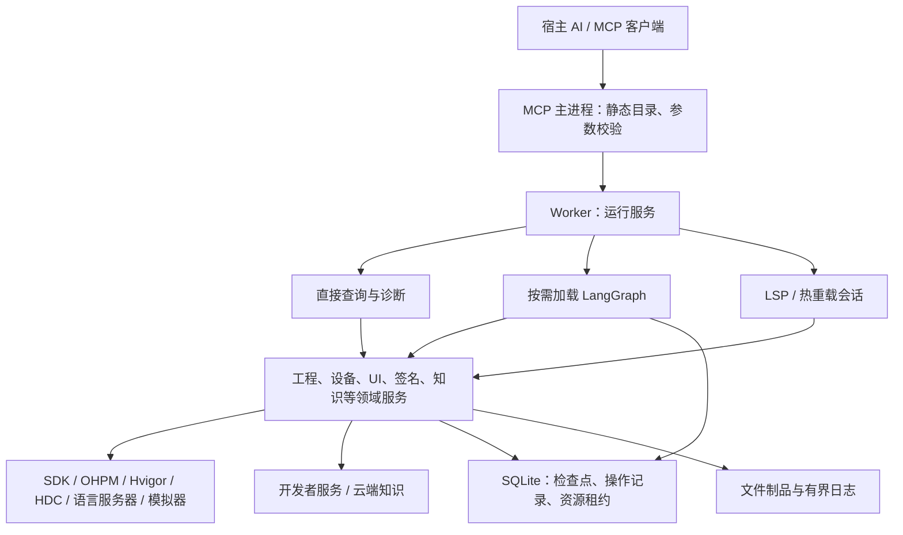

# deveco-tool

面向 HarmonyOS 开发的本地 MCP 服务，让支持 MCP 的 AI 宿主直接使用 DevEco 工具链，完成工程创建、构建、诊断、部署和设备 UI 验证。

原生版本使用 **TypeScript + LangGraph + SQLite**：固定流程由代码执行，任务可持久化、查询和恢复；宿主 AI 负责理解需求、查询知识和修改业务代码。使用原生版本无须安装官方 Skill、官方 CLI 或 CodeGenie 子 MCP。

> **当前正式版为 [v0.2.0](https://github.com/like3213934360-lab/deveco_tool/releases/tag/v0.2.0)。** 仓库只保留 TypeScript 源码和 `dist/src/cli.js` 编译入口，根目录安装、`npm run mcp` 和 CI 均使用原生实现；旧 CLI、子 MCP、Skill 安装目录及旧启动文件已删除。当前有 25 个公开工具、8 个公开工作流，执行协议为 `native-6`。这是带明确验收边界的正式发布：六组基础回归、干净安装、当前 SDK 专项、上游接收与现有历史设备证据已核对；28 行迁移行为、10 项直接性能能力及未复验设备场景仍在发布范围声明中保留，不宣称全平台、全设备或全部迁移场景完成。每份证据只对应其实际版本，见[完成清单](docs/native-completion.md)。

## 能解决什么问题

- **工程与构建**：检测 Studio / CLT / SDK，生成工程，直接调用 OHPM、Hvigor 同步和构建，核对产品、模块及实际制品。
- **代码诊断**：ArkTS 静态预检、语言服务器查询、Code Linter、真实编译数据库驱动的 clangd 检查，以及 API 兼容性扫描。
- **设备与验证**：HDC 安装、启动、日志和故障采集；UI 树、截图、中文输入、窗口定位、流程录制与重放，以及明确的最终断言。
- **专项能力**：直接管理 Hvigor watch 和设备热补丁，调用 SDK 签名工具、开发者认证服务及模拟器组件。
- **知识查询**：本地规则、示例和官方文档按需读取，云端知识显式查询；规则与资源保留上游来源和摘要。

这些能力在原生代码中已有实现，真实环境的验证范围见下文。`arkts_check` 是静态预检，不能替代完整构建；截图也不能自动证明业务流程成功。

## 架构



入口为 `src/cli.ts` → `src/server.ts` → `src/worker.ts` → `src/services/runtime.ts`。MCP 主进程只做协议处理和轻量分发，重型模块按需加载；普通查询不经过工作流检查点。大文本解析使用有界 CPU Worker 池，LSP 和热重载由会话服务管理。

| 层次       | 当前实现                                                           |
| ---------- | ------------------------------------------------------------------ |
| 编译       | TypeScript 6.0.3，严格模式，NodeNext / ESM，`allowJs: false`       |
| 运行       | 编译后的 JavaScript；验证基线为 Node 22.18+ 的 22 系列和 Node 24   |
| MCP 与校验 | 官方 MCP SDK 1.30.0、Zod 4.4.3                                     |
| 工作流     | LangGraph JS 1.4.14                                                |
| 持久化     | 官方 SQLite Checkpointer 1.0.4、better-sqlite3 12.10.0、SQLite WAL |
| 测试       | TypeScript 测试编译后使用 Node Test Runner；六组平台 / Node CI     |

进程管理、工程上下文、资源租约、错误分类、缓存、日志与制品集中实现。工程、产品、设备和输入在提交时固定；切换默认工程不会改变已经提交的任务。共享状态目录的多个 MCP 进程使用同一套租约协调冲突操作。

原生调用链不启动官方 CLI 或子 MCP，也不向模型注入整份 Skill。项目没有内嵌第二个自主编程 Agent：校验、顺序、分支和完成条件由工作流代码约束，开放式修复仍由宿主 AI 判断。

## 运行原生版本

### 1. 准备环境

使用 Node 22.18+ 的 22 系列或 Node 24，以及 npm、Git。实际构建需要现代 DevEco Studio 或 CLT 和对应 SDK；设备能力需要 HDC 连接，C/C++ 检查需要真实编译数据库，云端能力需要对应服务认证。

从源码安装：

```sh
git clone --branch v0.2.0 --single-branch https://github.com/like3213934360-lab/deveco_tool.git deveco_tool
cd deveco_tool
npm ci
npm run build
```

根目录使用锁定的原生依赖，无须再生成另一套 package.json 或重写锁文件。SQLite 等原生依赖须允许安装脚本；不要给 `npm ci` 加 `--ignore-scripts`，也不要跨操作系统、架构或 Node 主版本复制 `node_modules`。

维护者发布的编译包安装方式为解压、校验后执行 `npm ci --omit=dev`，无需安装 TypeScript 编译器。[v0.2.0 Release](https://github.com/like3213934360-lab/deveco_tool/releases/tag/v0.2.0) 同时提供编译包和公开验收回执，见[安装与升级](docs/native-installation.md)和[分发说明](docs/native-distribution.md)。

### 2. 配置工具链与 MCP 宿主

创建配置 JSON，例如 `/absolute/path/to/deveco-native.json`，将路径替换为本机实际绝对路径：

```json
{
  "studio": "/absolute/path/to/DevEco-Studio",
  "default_project": "/absolute/path/to/HarmonyProject"
}
```

macOS 的 Studio 路径通常为 `/Applications/DevEco-Studio.app`。使用 CLT 时把 `studio` 改为 `clt`，两者不能同时配置；可用 `java_home` 指定 JDK。`default_project` 可省略，之后通过 `switch_cwd` 选择工程。Windows JSON 中的反斜杠需要写为 `\\`。更多组件要求见[工具链探测](docs/native-toolchains.md)。

在宿主的 MCP 配置中添加 stdio 服务；宿主字段格式以其自身要求为准：

```json
{
  "mcpServers": {
    "deveco-native": {
      "command": "/absolute/path/to/node",
      "args": ["/absolute/path/to/deveco_tool/dist/src/cli.js", "mcp"],
      "env": {
        "DEVECO_CONFIG": "/absolute/path/to/deveco-native.json",
        "DEVECO_STATE_DIR": "/absolute/path/to/deveco-native-state"
      }
    }
  }
}
```

首次使用请选择独立的新状态目录；不要复用旧执行协议的数据库。原生配置使用 `DEVECO_CONFIG` 指向 JSON、`DEVECO_STATE_DIR` 指定状态目录，不读取旧版工具链环境变量作为兼容配置。

连接后先调用 `deveco_doctor` 核对工具链、工程和能力，再按需登录或运行工作流。也可在设置了同样两个环境变量的终端执行 `node dist/src/cli.js doctor`。修改编译产物后需让宿主重新连接 MCP；`deveco_restart` 只重启运行服务 Worker。

通过 MCP 给 `deveco_doctor` 显式提供 `target` 可只读检测设备的 UiTest 与文字输入组件；未提供时不访问设备。检测结果不等于实际 UI 操作已经验证，详见[驱动诊断](docs/native-ui-driver.md)。

`deveco_doctor.default_sdk` 单独返回已安装默认 SDK 的 `api_level`、`platform_version`、可用的 `package_version` 和元数据路径；这些值与 Studio 版本及 API 兼容性扫描目录分开。默认 SDK 未安装或元数据不完整时，该字段返回明确错误，不用其他组件版本推断 API 级别。

## 工作流

`workflow_catalog` 提供工作流定义、输入 Schema、所需能力和完成条件。当前公开目录包括：

| 工作流                | 执行过程与完成条件                                                                |
| --------------------- | --------------------------------------------------------------------------------- |
| `project_create`      | 校验 SDK 与参数 → 展开模板 → 生成配置 → 验证工程身份；拒绝覆盖已有目录            |
| `project_sync`        | 校验工程 → 按参数安装依赖 → 同步工程模型 → 验证实际模型                           |
| `project_build`       | 固定工程与产品 → 按参数同步 → 构建 → 提取诊断 → 核对制品及摘要                    |
| `app_deploy`          | 固定已有包集合 → 校验设备 → 安装 → 启动 → 核对应用进程                            |
| `build_deploy_verify` | 构建或热增量应用 → 部署 → 执行指定入口或流程 → 通过预先声明的 UI 断言             |
| `code_diagnose`       | 执行指定检查 → 分类诊断 → 关联规则与案例 → 返回建议和检查覆盖情况                 |
| `crash_diagnose`      | 固定输入日志或采集设备证据 → 按事件和进程解析 → 关联证据 → 给出诊断或证据不足说明 |
| `api_compatibility`   | 校验版本组合 → 调用扫描组件 → 规范化兼容性结果 → 输出报告                         |

默认不 clean、不升级 SDK、不自动修改业务代码。`project_build` 默认先同步，任务默认 `assembleHap`，也支持 HAR、HSP 和 APP 构建。`build_deploy_verify` 必须提交 `assert`，不接受把截图当作最终断言。

工程工具和工作流可用 `module_targets` 指定每个模块的 Hvigor 目标，例如 `{"entry":"preview","shared":"default"}`；`product` 选择产品，`target` 仍只表示 HDC 设备。提交后固定实际选择，恢复不受默认工程切换影响。`assembleApp` 由 SDK 按产品配置打包，不接受 `modules` 或非空 `module_targets`，需选择目标时使用 HAP/HAR/HSP 构建。详见[构建目标选择](docs/native-module-targets.md)。

创建工程时，`sdk_version` 指定已安装的编译 SDK，`target_api` 和 `compatible_api` 可分别设置目标行为 API 和最低设备 API；它们不必与编译 SDK 相同。省略时均使用所选 SDK 的 API，详见[工具链与版本配置](docs/native-toolchains.md)。

`project_path` 是要创建的完整工程目录，`app_name` 是应用名称，`bundle_name` 必须显式填写。迁移旧 `copy_template` 调用时，请将原来的父目录和应用子目录合并为 `project_path`；新工作流不追加目录名，也不自动生成包名。目标目录即使为空也必须尚不存在。

例如，通过 MCP `tools/call` 查询构建工作流，再提交任务：

```json
{
  "name": "workflow_catalog",
  "arguments": {
    "action": "get",
    "workflow": "project_build"
  }
}
```

```json
{
  "name": "workflow_run",
  "arguments": {
    "action": "start",
    "workflow": "project_build",
    "request_key": "sample-build-001",
    "input": {
      "project_path": "/absolute/path/to/HarmonyProject",
      "product": "default",
      "mode": "debug",
      "sync": true,
      "clean": false
    }
  }
}
```

`start` 在任务持久化后返回 `run_id`。用 `workflow_run` 的 `status` 动作和该 ID 查询结果，`wait_ms` 最多为 20000；`list` 列出任务，`read_artifact` 分页读取日志和报告。一个新的执行意图应使用新的 `request_key`：同一键与相同输入返回已有任务，同一键与不同输入报冲突。

### 持久化、恢复与取消

`run_id` 对应 LangGraph `thread_id`。任务状态包括 `queued`、`running`、`needs_input`、`interrupted`、`cancelling`、`succeeded`、`failed`、`cancelled`。检查点保留必要状态与制品引用，大日志、截图和凭据不写入图状态。

重启后未完成任务转为中断状态，恢复前重新核对执行协议、工具链、输入与资源。`resume` 只接受已声明的补充输入；当前 `resume_input` 为 `{"action":"recheck"}`，不能任意改写图状态。外部操作结果不明且无法核实时进入 `needs_input`，不会盲目重复安装、签名或点击；安装准备、UI 逐步操作、签名文件发布、热补丁和模拟器变更均有独立操作记录。云端 Profile 请求丢失且服务没有查询接口、设备完成回执缺失等情况仍需外部核实；不能保证这些情况自动恢复。

`cancel` 会传播到受管操作，确认停止后才标记已取消；不会终止共享 Hvigor 守护进程。取消和软件回退都不会撤销已经发生的工程修改或设备操作。

## 公开工具

以下为**原生接口**，旧工具名称没有别名。完整参数和结构化输出以 MCP `tools/list`、`workflow_catalog` 及[契约定义](src/core/contracts.ts)为准。

| 类别       | 工具                                                 | 用途                                                           |
| ---------- | ---------------------------------------------------- | -------------------------------------------------------------- |
| 工作流     | `workflow_catalog`、`workflow_run`                   | 定义查询、提交、列表、状态、恢复、取消与制品读取               |
| 知识与认证 | `harmony_knowledge`、`harmony_auth`                  | 本地 / 云端知识，开发者 / CodeGenie 登录、状态、登出和团队查询 |
| 管理       | `switch_cwd`、`deveco_doctor`、`deveco_restart`      | 默认工程选择、环境诊断、运行服务重启                           |
| 代码       | `lsp`、`arkts_check`、`code_lint`、`check_cpp_files` | 语言服务、静态预检、Linter 与 C/C++ 检查                       |
| 设备       | `device_info`、`hdc_log`                             | 设备发现与属性，日志收集、故障探测和读取                       |
| 应用       | `hot_reload`、`app_signature`                        | 热重载会话与补丁，签名配置、密钥、证书、Profile 和设备管理     |
| UI 查询    | `ui_snapshot`、`ui_observe`、`ui_find`、`ui_inspect` | 截图 / 树、结构观察、选择器查询、窗口与层级检查                |
| UI 操作    | `ui_tap`、`ui_control`、`ui_flow`、`verify_ui`       | 点击、手势与输入，导航、流程管理和录制，最终断言               |
| 模拟器     | `emulator_manage`、`emulator_scenario`               | 组件、镜像、实例及场景管理                                     |

签名写操作、热重载 `start / apply` 和模拟器变更同样先返回 `run_id`，通过 `workflow_run` 查询最终结果；内部固定任务不加入八个公开工作流目录。构建、同步、部署和 API 扫描统一从工作流进入。脚本目录执行、重复 LSP、旧 UI 代理和分散认证入口不属于原生工具目录。

### UI 流程与知识使用

UI 流程保存在工程的 `.arkpilot/flows/<id>.json`。公开 Ability 可作为直接入口，已保存流程可按 ID 或目标导航；未知目标在工程存在明确公开入口时建立空录制，入口歧义则返回候选供显式选择。返回录制任务不表示已经到达目标。录制草稿持久化并加密，文本输入转为运行时变量，最终断言通过后才保存流程或修复选择器。保留的旧流程需先通过新版校验，详见[UI 工作流](docs/native-ui-workflows.md)。

`ui_snapshot` 默认只截图，读取树需指定 `mode: "tree"` 或 `"both"`。`ui_find` 可复用快照，也可查询保存的树；离线结果不代表设备当前状态。点击前需要明确目标，手势和中文输入使用 `ui_control`，流程完成使用 `verify_ui` 或工作流断言核对。

外观检查可用 `verify_ui.review.requirement` 提供具体要求，服务保存截图和验收报告；`workflow_run.read_artifact` 指定 `as: "image"` 后返回可供宿主 AI 审阅的 PNG/JPEG。控件断言通过与外观审阅分开记录，请求外观审阅时不会自动返回整体通过。详见 [UI 验收证据](docs/native-visual-review.md)。

`harmony_knowledge` 默认查询本地内容，通过 `catalog / search / read` 按需取得规则、示例和文档。云端查询须显式指定 `source: "cloud"`。`harmony_auth` 的 `developer` 与 `codegenie` 是独立认证服务，凭据分开存储，不能互换 Token。详见[知识服务](docs/native-knowledge.md)和[认证](docs/native-authentication.md)。

`crash_diagnose` 按实际异常、错误码和应用栈关联 45 条本地故障模式，并返回源版本和参考表行号。生产设备限制 shell 读取故障文件时，可经 HDC 文件服务读取同一原名文件；诊断保留截断、SourceMap 缺失和未匹配状态，详见[崩溃诊断](docs/native-crash-diagnosis.md)。

## 状态、日志与资源管理

状态目录优先级为 `DEVECO_STATE_DIR` → 配置文件 `state_dir` → 用户目录下的 `.deveco-tool`。同一原生执行协议的实例共享该目录时，SQLite 租约协调工程写入与设备冲突操作；这不控制手工操作或其他软件。

默认保留已结束任务 7 天、最多 100 条，日志、制品及受管存储使用 256 MiB 记账预算。可通过配置中的 `retention_days`、`max_runs`、`max_bytes` 调整。未完成任务不自动清理，额度不足会明确报错；外部 SDK 突发写入和 SQLite 文件占用仍需实际容量监测，记账预算不是操作系统硬配额。

工具返回摘要和制品引用，日志关联请求、任务、节点和受管进程，用于区分排队、外部执行与内部处理耗时。错误区分工程问题、工具失败、能力不可用和证据不足。制品归属、清理和进程退出确认见[存储说明](docs/native-storage.md)、[制品所有权](docs/native-artifact-ownership.md)及[进程管理](docs/native-process-ownership.md)。

## 验证结果与当前边界

核心架构重构已合入 `main`（合并提交 `943fb3d`），`v0.2.0` 作为首个原生正式版发布。当前迁移矩阵共 47 项：28 项 pending、19 项已有凭证；正式发布没有把 pending 改写为通过，而是由 `provenance/release-scope-0.2.0.json` 逐项固定发布边界。凭证只证明各自已核对的范围，逐项状态见[验收证据核对](docs/native-acceptance-review.md)，当前问题见[迁移状态](docs/native-migration-status.md)。

`579449e` 的[六组 CI](https://github.com/like3213934360-lab/deveco_tool/actions/runs/34330094583) 中，macOS / Linux × Node 22 / 24 各 364 项、Windows × Node 22 / 24 各 353 项适用回归通过，六组干净安装各 10 项通过，两个 Windows 作业的原生进程检查各 20 轮通过。整轮 CI 仍因上游接收凭证未刷新而失败，不能写成整轮通过。

实际宿主已通过公开维护入口切换到 `native-6-main-7a844f7-1`，运行身份为 `cc3cdfd1`，使用 Node 24 与独立 2 GiB 状态目录。Codex 应用内重连、Developer 与 CodeGenie 新状态登录、云端只读查询及十份既有流程摘要保留均已确认；旧完整安装与加密状态仍保留用于回退。该宿主候选早于 `v0.2.0` 最终提交，因此不能作为正式发布字节的等同证明。生产安装与开发编译摘要的区别见[分发记录](docs/native-distribution.md)。

以下表格保留历史提交 `caf97cc` 的结果：当时[六组 CI](https://github.com/like3213934360-lab/deveco_tool/actions/runs/34231914954) 全部通过，各组编译摘要均为 `90b34d88`，上游锁摘要均为 `bf3cc411`。真实 SDK 和设备记录分别绑定其原始版本；后续各轮结果与失败原因见[完成清单](docs/native-completion.md)。

| 范围 | 已核对的结果与范围 |
| --- | --- |
| 基础运行矩阵 | macOS / Linux × Node 22 / 24 各 312 项、Windows × Node 22 / 24 各 301 项适用回归通过，零失败、取消、跳过；两个 Windows 作业各 20 轮进程压力检查通过 |
| 干净编译包安装 | 六组各 10 项通过；401 个文件的分发清单完全一致，无须安装 TypeScript 编译器、官方 CLI、CodeGenie 子 MCP 或 Skill |
| 真实 SDK | macOS arm64、Studio 26.0.0.821、SDK 26.0.0.105；同一 `90b34d88` 编译版本的 SDK 19 项、Checker 13 项和 Linter 6 项通过 |
| 真机与个人签名 | 同一编译版本的设备只读 14 项、命名故障日志与诊断 6 项、已有个人签名包的 SDK 验签通过；后者没有重复创建云端证书或 Profile |
| 设备热补丁 | 同一编译版本的专用验收应用完成连续两次真实 HQF，界面断言通过且 PID 保持；停止 watch 并恢复源码 |
| 模拟器 | 同一编译版本的只读与实例生命周期各 7 项通过；另有验收应用实际观察 80% → 37% → 64% 电量的分项证据，不扩大为所有传感器已验证 |
| 上游接收 | `deveco-code` 的 10 项、`deveco-cli` 的 25 项映射检查已接收，CI 上游门禁通过；前序评审和失败报告原样保留 |

SDK、设备和上游适配接收使用的分项报告仍带接收前的原始源锁，不能自动改成最终 Release 的证据。六组 CI 证明基础运行与安装，不证明 Windows / Linux 的真实 SDK 和设备能力。真实设备记录见[签名与热补丁验收](docs/native-signing.md)，模拟器边界见[模拟器说明](docs/native-emulator.md)。

同一 `90b34d88` 编译版本对冻结旧网关的离线 `ui_find` 复测完成 18,000 次查询，每次核对实际匹配结果：101 / 1001 / 10001 节点分别进行三轮、新旧各 1000 次，P95 分别下降 30.2%–32.7%、69.2%–72.4%、79.8%–81.2%。这些结果只覆盖保存树的精确查询，不代表首次加载、真实设备或其他能力的速度。完整数字、旧版本测量和复现方法见[UI 性能记录](docs/native-ui-performance.md)。

**v0.2.0 明确保留的验收边界：**

- 迁移清单仍有 28 项行为验收待接收；其中 3 项凭证仍绑定历史 dev22 设备验证。pending 不等于尚未实现，也不因本次正式发布自动转为 verified。
- 真实过期认证、更多显示器和设备场景，以及最终版本下的专项验收仍待补齐。
- 19 项直接能力中有 9 项完成桌面端每项 1,000 次采样；其余 10 项未补跑。固定输入的热重载状态、LSP、流程目录延迟保留为观察项，不使用没有官方依据的相对阈值扩大结论。
- 用户取消本轮新增真机测试；发布门禁仅接收原始范围明确的历史设备报告。dev22 曾通过一小时活动与六分钟空闲回收，后续失败原样保留，不宣称 `v0.2.0` 已重新完成真机长稳。
- Codex 应用内 MCP 已重连当前安装，Developer 与 CodeGenie 重新登录及云端只读复验分别通过；隔离升级/回退和十份既有流程保留已确认。旧完整安装及加密回退记录保留。

`release-gate` 会核对最终运行文件、依赖锁、资源摘要、上游接收、原始报告及精确发布范围；缺失、重复、改写或超出 `v0.2.0` 范围声明的例外会阻止发布。已实现与待验收项目分别记录在[完成清单](docs/native-completion.md)。

## 开发、更新与交付

原生目录结构：

```text
src/cli.ts, server.ts, worker.ts   启动、MCP 协议与 Worker 边界
src/core/                        契约、配置、进程、存储、租约等基础能力
src/services/                    工程、诊断、设备、UI、会话、认证等服务
src/maintenance/                 宿主配置升级、回退和安装记录清理
src/core/workflows.ts            LangGraph 图与工作流执行
resources/                       模板、规则、文档及原生设备资源
provenance/                      上游锁、来源映射与迁移清单
scripts/*.ts, test/*.ts           构建、验收、升级脚本与回归测试
docs/native-*.md                 实现边界与验收记录
```

在仓库根目录执行；证据输出目录必须不存在：

```sh
npm run typecheck
npm run build
node dist/scripts/native-regression.js /absolute/new-regression-evidence
node dist/scripts/native-migration-audit.js
node dist/scripts/resources.js
```

`native-migration-audit.js --release` 是发布门禁，当前未通过全部迁移验收时应失败。SDK、设备与性能专项不由基础回归替代；执行方式和操作范围见对应文档。

上游来源包括 [deveco-code](https://gitcode.com/openharmony-sig/deveco-code)、[deveco-cli](https://gitcode.com/openharmony-sig/deveco-cli) 的协议参考，以及 SDK / Hypium 等实际组件。`provenance/upstream-lock.json`、`upstream-mapping.json` 和资源清单记录版本、摘要与下游映射。

更新流程为：检测提交 → 下载并核对候选 → 分类差异及影响 → 准备草稿 PR → 人工适配流程 / 协议 → 契约、回归、平台与性能验证 → 评审发布。仓库提供定时 / 手动候选工作流、带摘要校验的适配工具和 Release 工作流；定时权限及完整发布链路仍待统一验收。未映射变化会阻止候选通过；自然语言新增要求不能保证自动正确转换为代码。运行中的 MCP 不动态拉取或执行最新上游代码，框架依赖升级与官方工具链适配分开提交。详见[上游更新机制](docs/native-upstream-upgrades.md)。

升级时先结束任务与会话，在新目录安装完整版本，配置工具链并重新登录，校验保留的 UI 流程后再运行 doctor、构建和设备检查。不同执行协议使用独立状态目录；回退通过切换完整安装目录完成。正式编译包见 [v0.2.0 Release](https://github.com/like3213934360-lab/deveco_tool/releases/tag/v0.2.0)，具体步骤见[安装与升级](docs/native-installation.md)。

## 文档与许可证

| 主题       | 文档                                                                                                                                                                                                           |
| ---------- | -------------------------------------------------------------------------------------------------------------------------------------------------------------------------------------------------------------- |
| 迁移与交付 | [迁移执行记录](docs/native-migration-status.md) · [安装与升级](docs/native-installation.md) · [分发](docs/native-distribution.md)                                                                              |
| 工程与诊断 | [工具链](docs/native-toolchains.md) · [工程上下文](docs/native-project-context.md) · [语言服务](docs/native-language-service.md) · [静态预检](docs/native-static-checker.md) · [Linter](docs/native-linter.md) |
| 设备与应用 | [设备发现](docs/native-device-info.md) · [部署](docs/native-deployment.md) · [签名与热补丁](docs/native-signing.md) · [模拟器](docs/native-emulator.md)                                                        |
| UI         | [流程](docs/native-ui-workflows.md) · [输入与手势](docs/native-ui-controls.md) · [截图](docs/native-screenshots.md) · [保存树导入](docs/native-ui-import.md) · [性能](docs/native-ui-performance.md)           |
| 数据与上游 | [存储](docs/native-storage.md) · [认证](docs/native-authentication.md) · [知识](docs/native-knowledge.md) · [更新机制](docs/native-upstream-upgrades.md)                                                       |

本项目自有代码采用 [MIT License](LICENSE)。第三方代码、资源及参考实现保留各自许可证与出处，见 [deveco-code 声明](NOTICE.deveco-code)、[deveco-cli 声明](NOTICE.deveco-cli)、[Hypium 声明](NOTICE.hypium)及 `provenance/` 中的来源记录。
