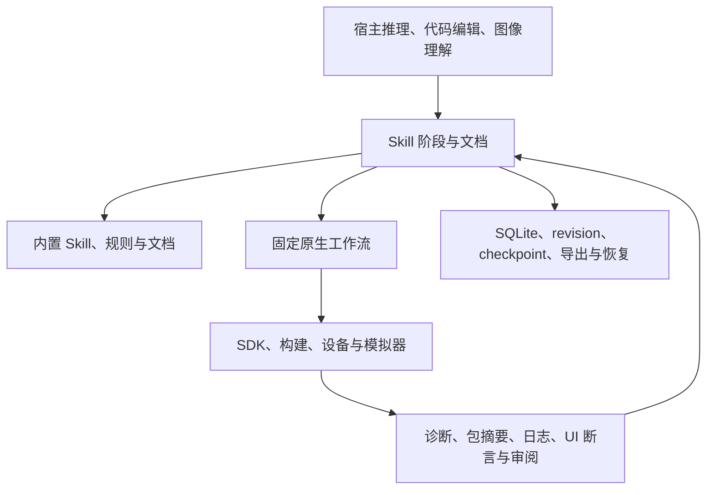

# 当前 DevEco MCP 与上游 deveco-code 差异调查

调查日期：2026-09-12（Asia/Shanghai）。目标：判断当前 MCP 是否完整承载上游 Skill 与功能，并通过工作流编排提升可靠性。本文区分功能实现、资源完整性、宿主依赖和实际验收，不把目录覆盖率当作功能完成率。

## 结论

**当前 MCP 已覆盖上游 6 个产品内置 Skill 的主要领域，并实现了原生工具与持久化工作流；但尚不能称为“包含所有上游 Skill 和功能，且全部完成等价验收”。**

已经确认的基础：29 个公开 MCP 工具、8 个固定原生工作流、8 个引导式 Skill 工作流、6 个改编 Skill、79 条规则/案例/示例，以及 14,683 篇本地文档。6 个 Skill 的全部 9 个可读文件均已通过实际 MCP 读取，内容与安装文件逐字一致。

主要差距集中在：部分 Skill 语义缩减；上游计划、调试、规格开发的独立资产被宽泛排除；工作流协调完成与需求验收不是同一件事；宿主能力和不支持结果仍出现在“verified”台账；部分知识链接失效；LSP、录制、日志及依赖 CLI 的新增启动检查仍存在当前版本边界。

## 1. 审计的是哪个版本

| 对象 | 本次确认结果 | 应如何使用 |
| --- | --- | --- |
| 当前会话实际 MCP | `0.3.0 / native-7`，Node `24.14.1`，29 个工具 | 本报告“当前能力”的主基准 |
| 实际安装 | `~/Library/Application Support/DevEcoMCP/installations/native-7-release-0.3.0-20260911-1` | 安装清单 460 个文件摘要全部匹配 |
| 当前工作目录 | `/Users/dreamlike/DreamLike/deveco_tool`，`main` / `d2d3efd`，包版本 `0.2.0` | 比运行版旧，不能直接据此认定当前 MCP 缺少 Skill |
| 可还原的当前源码 | `713734c8eaf40d52013ff88982306aef0d0c563f` | 106 个源码 TS 单文件转译结果均与安装 JS 完全一致；129 个资源、5 个安装 provenance 文件一致 |
| 另一个工作树 | `/Users/dreamlike/.codex/worktrees/5ab5/deveco_tool`，存在大量 `0.4.0` 未提交修改 | 是候选工作，不能算作已安装能力 |
| 上游 Code 锁定提交 | `aeb4536e56d1bfe8b5a0ff3bb02acb99f3523f2a`，`develop` | 当前 Skill 来源 |
| 上游 Code 本次远端 HEAD | `7b9b68c2f65e25d6a91f13d47d5b75622aacfe20`，默认分支 `develop` | 从当前锁到 HEAD 只有每日发布流水线新增，没有 Skill/领域工具变化 |
| 上游最高版本标签 | `v0.1.12` / `4f6825973d45cdb304803dbadc291ee016b65626` | 不应只拿旧 `v0.1.11` 文件名判断是否落后 |
| 当前 CLI 依赖来源锁 | `a71f93d73941aaa0dbf581918cbd5828014e6e88` | 应与 Code 本体的来源锁分别管理 |

本次通过 Git 直接读取官方仓库固定提交；网页抓取失败没有被当成“上游不存在”。[上游仓库](https://gitcode.com/openharmony-sig/deveco-code)、[审计提交](https://gitcode.com/openharmony-sig/deveco-code/tree/7b9b68c2f65e25d6a91f13d47d5b75622aacfe20)。

当前运行证据见 [runtime-snapshot.json](runtime-snapshot.json)，安装字节校验见 [installation-integrity.json](installation-integrity.json)，完整入参 schema 见 [installed-tool-schemas.json](installed-tool-schemas.json)。

## 2. 当前所有公开工具

以下按安装包实际导出的 schema 枚举；与当前会话的 29 个工具名称逐一吻合。构建/部署等功能通过工作流提供，不应因为没有同名独立工具就算缺失。

| 工具 | 主要功能 / 操作 |
| --- | --- |
| `skill_manage` | `catalog / read`，内置 Skill 检索、正文和引用读取 |
| `skill_workflow` | `catalog / start / list / read / write / transition / publish`，引导式流程与文档持久化 |
| `workflow_catalog` | `list / get`，固定流程的输入、能力要求与完成条件 |
| `workflow_run` | `start / list / status / resume / cancel / read_artifact / capacity / cleanup_plan / cleanup_apply / export / storage_receipt` |
| `harmony_knowledge` | `catalog / search / read`，规则、本地文档及显式云检索 |
| `harmony_auth` | `login / status / logout / teams`，Developer / CodeGenie 认证服务 |
| `switch_cwd` | 切换明确的项目上下文，选择 product 和 module targets |
| `deveco_doctor` | 运行版本、工具链、SDK、能力与资源状态；不带设备参数时不探测设备 |
| `deveco_restart` | 原生 worker 重启 / 运行恢复 |
| `lsp` | `hover / definition / implementation / references / diagnostics / documentSymbol / workspaceSymbol / prepareCallHierarchy / incomingCalls / outgoingCalls`；schema 存在不等于每种语言后端都实现 |
| `arkts_check` | ArkTS 静态预检，不能替代编译 |
| `code_lint` | Code Linter 检查和结构化报告 |
| `check_cpp_files` | 基于真实编译数据库的 clangd C/C++ 检查 |
| `device_info` | `list=true` 读取设备清单，或读取明确目标的设备属性 |
| `hdc_log` | `collect / probe / fetch / clear`，有界 Hilog 与指定故障日志 |
| `hot_reload` | `start / status / apply / stop`，Hvigor watch 与设备热补丁 |
| `app_signature` | `inspect / configure / keypair / csr / sign / verify / certificates / certificate_create / certificate_delete / profile_create / profile_delete / devices / device_register` |
| `ui_snapshot` | `image / tree / both`，截图与 UI 树 |
| `ui_observe` | 面向决策的 UI 状态摘要 |
| `ui_find` | 文本、类型、节点、窗口、应用和属性约束下的查找 |
| `ui_tap` | 根据当前证据定位并点击 |
| `ui_flow` | `list / read / validate / save / delete / routes / run / navigate / record_start / record_status / record_stop / record_cancel` |
| `verify_ui` | 明确的最终 UI 断言 |
| `ui_review` | `list / status / cancel / complete`，精确图像制品的审阅回执 |
| `ui_test` | `start / plan / status / resume / cancel / finish / check / act / replan / logs / report / export`，自然语言测试的持久步骤与证据 |
| `ui_inspect` | 控件、窗口、显示等精细检查 |
| `ui_control` | 控件输入/选择/滚动、按键、鼠标、触摸等原生动作；可直接执行的动作与可录制动作应分别核对 |
| `emulator_manage` | `list / start / stop / create / delete / images / image_install / image_uninstall / license_view / license_accept` |
| `emulator_scenario` | `shake / power / rotation / volume / folded_state / battery / battery_status / gps / outdoor_running / outdoor_cycling / driving_navigation / sensor` |

## 3. 固定工作流与 Skill 工作流

| 固定原生工作流 | 编排目标 / 完成边界 |
| --- | --- |
| `project_create` | 创建 SDK 匹配工程，确认工程模型和应用身份 |
| `project_sync` | OHPM 安装、Hvigor 同步、检查当前工程模型 |
| `project_build` | 可选同步 → 新鲜完整 ArkTS 预检 → 编译 → 核对制品与摘要 |
| `app_deploy` | 核对包 → 安装 → 启动 → 检查进程；进程存在不等于业务页面正常 |
| `build_deploy_verify` | 预检 → 构建或热更新 → 部署 → 可选已存流程 → 显式最终 UI 断言 |
| `code_diagnose` | ArkTS / Linter / LSP / C++ 检查及知识关联；诊断完成不等于编译通过 |
| `crash_diagnose` | 有界故障证据 → 帧解析 → 模式/案例匹配，允许明确证据不足 |
| `api_compatibility` | 验证源/目标 SDK 版本 → API 变化扫描 → 报告 |

| 引导工作流 | 当前编排 | 主要边界 |
| --- | --- | --- |
| `plan` | 计划、实施、验证文档与阶段管理 | 与上游只读计划 agent 不同；没有必需原生完成回执 |
| `debug` | 复现、证据、假设、修复、设备/UI 验证 | 宿主负责推理和改代码；未保留上游全部取证脚本行为 |
| `spec` | `spec.md / plan.md / tasks.md` 和验证证据 | 仍缺逐条需求、任务、验收证据的强关联 |
| `customize` | 宿主 MCP 接入与配置指导 | 比上游完整 DevEco 定制范围窄；没有必需原生完成回执 |
| `arkts` | 规范 → 编辑 → 诊断/构建 | 编辑由宿主完成，构建证明不了任意业务目标 |
| `repair` | 原始诊断 → 错误案例 → 修复 → 复检/构建 | 要求成功构建类证据，语义判断仍由宿主承担 |
| `create` | SDK 模板 → 入口/路由 → 实现 → 构建/验证 | 不等于所有用户故事均已实现 |
| `ui_test` | 固定步骤 → 有界动作 → 断言 → 图像审阅 → 完成 | 这一类对业务结果的结构化约束最强；图像理解仍由宿主完成 |

现有架构已经具备实质编排：

值得保留的机制包括：阶段 revision 检查、定义摘要固定、项目/设备/应用作用域、实施阶段之后的证据时间检查、被引用证据保护、失败/不确定动作不盲目重放、构建前新鲜预检、UI 无进展后强制重新规划、安装回执落盘后释放临时包。它们提升了执行可追踪性；当前没有足够依据宣称所有操作都比上游更快。

## 4. 上游 Skill 和资源到底覆盖多少

| 上游产品 Skill | 本地 Skill | 判断 |
| --- | --- | --- |
| `arkts-grammar-standards` | `deveco-arkts-standards` | 规范和示例主体保留，入口改为 MCP 查询/预检/构建 |
| `arkts-error-fixes` | `deveco-arkts-errors` | 错误案例和例程保留；部分正文相对链接未随迁移修正 |
| `arkts-runtime-fix` | `deveco-runtime-debug` | 保留调查方法，脚本型日志/假设/报告流程被原生服务与宿主推理替代；需逐行为验收 |
| `deveco-create-project` | `deveco-project-create` | 创建脚本替换为 SDK 模板与原生创建工作流 |
| `deveco-cli` | `deveco-native-tools` | 核心 SDK/设备能力原生化，但不能仅凭 Skill 名称证明每一条 CLI 子命令等价 |
| `customize-deveco` | `deveco-customize-host` | 从完整产品定制缩为宿主 MCP 接入/指导，语义范围确有缩减 |

上游 `packages/opencode/resources/skills/` 共 100 个文件，当前清单直接映射 85 个：78 个逐字节一致、6 个 Skill 入口重写、1 个规范文件修改两处引用。15 个没有原样入包，包含 README、中文 Skill 入口、evals、调试/创建脚本及 FILES 说明。**未原样收录的脚本不能直接算功能丢失，必须逐行为核对原生替代；反过来，原生替代也不能自动等同原脚本全部行为。**

另外，上游仓库有两个开发专用 Skill：`.agents/skills/gitcode-pr` 和 `.opencode/skills/effect`。它们不属于面向 HarmonyOS 用户分发的 6 个产品 Skill，当前未纳入。按真实非测试 Skill 计算是 8 个，必须单列这两个，不能静默从覆盖范围消失。全仓库实际有 10 个 `SKILL.md`，另外 2 个是 `agents-sdk / cloudflare` 测试夹具，应归入测试资源，不能当作产品功能。

知识与文档完整性检查：

- 79 条知识 = 40 个 case、32 个 example、7 个 rule，文件摘要全部通过。
- 文档源是独立的 `deveco-cli-assets 1.3.1`，不是 Code 仓库本身的完整文档树；这次验证证明锁定包内部完整，不证明最新在线文档已同步。`docs.zip` 的 31,467 个 ZIP 条目 CRC 检查通过；14,685 个文件中索引出 14,683 篇文档。
- 文档索引 SQLite `quick_check=ok`；14,683 个索引 ID 均能定位 ZIP 中对应 Markdown，23,535 个搜索 segment 没有孤立文档引用。
- 知识正文中 61 个相对 Markdown 链接，51 个在安装布局中无法解析：50 处仍引用旧 `../assets/*.ets`，实际资产已搬到 `examples/`；1 处上游原本就引用不存在的 `state_migration.md`。这不是例程资产丢失，`related_ids` 仍可读，但正文导航不自洽。

## 5. 必须明确的差异与缺口

| 编号 | 差异 | 对目标的影响 | 建议处理 |
| --- | --- | --- | --- |
| G01 | 当前运行、主工作目录和候选工作树分属不同版本 | 容易把未发布功能当作已有，或误报运行版缺项 | 固定运行/源码/资源/上游/SDK 身份后再计算覆盖 |
| G02 | 上游 28 工具、50 操作台账均标 `verified`，证据结果却分为 35 `executed`、15 `unsupported` | “边界已验证”不能算“功能已提供”；其中大部分是合理宿主职责，但不等于 MCP 自身完整实现 | 分开 required-native、host-delegated、intentional-boundary，分别统计 |
| G03 | 工具列表由本地代码硬编码；上游 specs、agents、command templates 等被宽泛 exclude | 新增工具、参数、提示词、规格流程变化可能无法进入当前覆盖检查 | 从固定上游提交自动发现所有资产并跟踪内容摘要，未知变化阻断接收 |
| G04 | `plan` / `customize` 可凭一份非空文档完成；`spec` 没有强制逐故事验收 | 当前只证明协调生命周期结束，不能证明原始目标完成；代码也明确返回 `verified:false` | 给需求、任务、断言分配 ID，按目标类型要求证据；保留协调完成/业务验证两种状态 |
| G05 | 验证证据匹配项目/作用域/时间，但未完整绑定被验证代码快照和后续文件变动 | 构建之后再改源码仍可能引用旧构建作为 Skill 完成依据 | 绑定源码、配置、工具链和制品指纹，改动后使受影响证据失效 |
| G06 | `customize` 未完整保留 models/providers、agents/subagents、commands、plugins、permissions 等上游定制范围 | 有同名替代 Skill，但不是全量等价 | 为支持的宿主提供能力握手和适配器；不支持的产品专属功能保留显式状态 |
| G07 | 51 个知识相对链接失效 | AI/用户沿正文引用读取时会走错路径 | 统一转为稳定知识 ID/MCP 读取入口，并测试整个引用图 |
| G08 | 上游产品 SDD 的 5 命令、3 模板及 agent/command 行为没有独立来源映射 | 引导 `spec` 不能证明所有上游阶段语义和模板均已承接 | 把命令、模板、agent prompt 独立纳入清单与流程需求 |
| G09 | 当前 ArkTS 的 `documentSymbol / workspaceSymbol / prepareCallHierarchy / incomingCalls / outgoingCalls` 五项受能力检查阻断；clangd `outgoingCalls` 不支持 | schema 存在不等于后端可执行；不能用 clangd 的四项成功替代 ArkTS 同名能力验收 | 按 language × SDK × operation 做正例与边界验证 |
| G10 | 直接 UI 动作、保存流程、录制回放和自然语言测试的动作集合不完全一致 | “能直接点/输/鼠标操作”不代表完整可录制、跨重启可回放 | 用同一版本化 action schema 驱动各入口，逐动作验收 |
| G11 | 当前 UI 日志是有界 Hilog 部分证据 | 不能宣称持续、完整的全过程日志 | 做有界持续采集与截断/丢失声明，覆盖应用重启、设备断连、取消及存储限制 |
| G12 | Code 依赖 CLI 的版本推进独立于 Code HEAD | Code 自身没有新工具不代表传递依赖没有新行为；启动后故障检查应单列 | 独立锁、独立差异清单、组合工作流真实验收 |
| G13 | 当前源码发布范围保留 28 项迁移、22 项验收、19 项性能例外 | 正式发布并不等同所有组合/平台/性能已证明 | 按最终发布字节关闭适用例外，实际环境阻碍保持未完成 |

G04/G05 做了隔离服务级复现，未写生产 SQLite，也未调用设备。`plan/customize` 仅 `notes.md="x"` 就能到 `completed/succeeded`，返回值仍为 `verified:false`。`spec` 无证据时正确拒绝；在隔离测试库提供同项目、实施之后的合成成功构建回执，即可完成，而不要求两条用户故事逐项对应 UI 证据，也不检查构建之后的文件改动。**该合成用例证明的是服务完成门槛结构，不是实际编译、设备验证或公开 MCP 伪造攻击。** 详见附带复现结果与脚本。

G12 的具体版本关系：Code 当前固定依赖 `@deveco/deveco-cli 1.3.2`，并非自动跟随 CLI develop。独立 CLI 本次 HEAD 是 `87c360b05848132c06c6ea120e078619b9ef4634`；当前 MCP 锁定 CLI `a71f93d…` 到该 HEAD 有 38 个变化路径，其中 `37b82a2…` 合入了 run/apply 后崩溃与白屏检查。该项属于扩大到 CLI develop 的升级目标，不能算作“Code 从当前锁到 HEAD 新增了功能”。本次仅对这条传递依赖做有限核查，没有把 CLI 的全部变化宣称为已逐项端到端验收。[CLI 上游](https://gitcode.com/openharmony-sig/deveco-cli/tree/87c360b05848132c06c6ea120e078619b9ef4634)

## 6. “所有上游功能”应怎样落成可验收目标

建议把目标明确为：**上游所有产品领域能力逐项承接；所有 Skill/命令/模板保留可追踪来源与行为映射；执行由 MCP 编排；宿主专属能力声明并实际适配；每项业务完成由合适证据证明。**

上游是完整 AI Agent 产品，包含 TUI、会话、模型 Provider、权限、通用文件编辑/命令/搜索、多 agent 调度、插件和 MCP 客户端管理。当前项目是 MCP 服务。让原生 MCP 承担 HarmonyOS 执行、让 AI 客户端承担推理/编辑是合理设计；要满足“全部覆盖”，这层职责必须进入显式能力契约，而不是靠排除规则隐去。

不要用一个百分比合并以下不同结论：资源原文保留率、领域动作可执行率、宿主适配率、工作流语义覆盖率、当前版本真实验收率。

## 7. 实施顺序与验收条件

| 顺序 | 交付内容 | 可关闭的验收条件 |
| --- | --- | --- |
| 1 | 建立全量上游清单与新覆盖门禁 | 自动发现 Skill、引用、脚本、agent、commands、SDD、registry 操作/参数、传递 CLI；每项有源摘要、映射、负责人和状态；required 项不能用 unsupported 通过 |
| 2 | 完整资源档案与可用引用 | 原版与本地改编分层保存；9 个 MCP Skill 文件、79 条知识、全部引用图与文档索引持续校验；修复 50 个迁移断链，解释/修复 1 个上游断链；开发专用 2 Skill 有明确归属 |
| 3 | 补齐领域行为 | LSP 后端能力、完整动作录制回放、持续 UI 日志、启动后故障检查、热更新/模拟器实际效果逐项完成；复用现有候选工作并核对当前状态 |
| 4 | 加强计划/规格/调试/定制工作流 | 原始要求不可被删除；requirement/task/assertion/evidence 有关联；按目标选构建、运行、UI/人工审阅证据；代码变化使旧证据失效；跨重启/取消/重规划正确 |
| 5 | 宿主适配与清晰边界 | 宿主能力握手覆盖文件、执行、推理、图像、子任务、配置等；有能力才启用相应流程；无能力给具体缺项，不能宣称自包含 |
| 6 | 最终发行验收 | 所有要求的正例/负例、SDK/语言/平台组合、设备效果、恢复、配额、性能与长稳绑定同一发布身份；随后核对实际安装版本和包摘要 |

现有 `0.4.0` 工作树已经在推进 LSP、启动检查、门禁、完整录制、连续日志、兼容升级和效果验收。其进度文档及未提交代码属于候选证据，本次没有把它们重新标为当前运行版已完成。后续应接续并验证这批工作，避免重复实现；同时补上本报告发现的资源引用、SDD 来源追踪和需求证据关联问题。

## 8. 本次验证范围与附件

本次进行了：官方 Git 来源核对；运行 MCP 实际只读调用；安装清单哈希核对；源码与安装字节核对；Skill/知识/文档完整性检查；公开 schema 盘点；工作流与验收门禁静态审计；隔离状态库最小复现。

本次没有重新执行全量构建、设备安装/交互、云端写操作、六平台运行矩阵或全部性能测量。发布范围中的历史记录只用于判定当前声称的边界，不冒充本次实测。调查结论不等同“全部功能已通过端到端验收”。

- [运行只读快照](runtime-snapshot.json)
- [安装文件校验](installation-integrity.json)
- [29 工具与工作流完整 schema](installed-tool-schemas.json)
- [Skill 实际读取与知识目录](skill-read-verification.json)
- [上游全量资源、Agent、命令及版本调查](upstream-findings.md)
- [当前工具全部动作与上游 50 项逐条映射](local-capabilities.md)
- [工作流逐项语义、优化和门槛调查](workflow-findings.md)
- [51 处知识断链明细](knowledge-broken-links.json)
- [隔离探针结果](workflow-gate-probe-result.json) / [可复现脚本](workflow-gate-probe.mjs)
- [当前 0.3.0 能力矩阵原件](upstream-capabilities-0.3.0.json)
- [当前 0.3.0 发布范围原件](release-scope-0.3.0.json)

源码行号和上游位置集中在三份详细调查中。当前源码可用 `git show 713734c8eaf40d52013ff88982306aef0d0c563f:<path>` 还原；上游 Code 固定于 `7b9b68c2…`。报告中的 `/tmp` 路径是本次只读审计副本，长期复核应使用这些固定提交，避免依赖临时目录继续存在。
