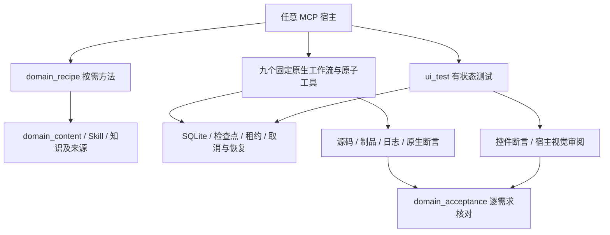

# MCP 领域配方、知识与原生流程

领域内容随 MCP 包分发，任意宿主都可通过工具读取，也可使用 MCP Resources/Prompts。宿主负责推理、文件编辑、计划、模型、会话、代理和权限；MCP 提供 HarmonyOS 原生能力、确定性执行、恢复与可核验的结果。读取配方不创建持久任务，也不声明用户目标已完成。

## 按需配方

1. `domain_recipe catalog` 列出八种方法；`read` 使用 `id`，返回领域方法、适用原生工作流、可追踪 Skill/知识引用和验收关系。正文只在需要时读取。
2. `plan` 是规划指南；`customize` 是可选宿主接入配方；`spec` 提供可选规格模板。它们没有 start/write/transition/publish 生命周期。
3. `arkts`、`repair`、`create`、`debug` 复用固定原生执行，不分别维护通用指导任务。宿主保留原始需求与修订，通过编辑完成实现。
4. `workflow_catalog list` 返回精简目录，`get` 读取一个流程的完整输入 schema；`ui_actions` 读取共享动作协议。已知流程可依据工具输入 schema 直接调用 `workflow_run start`，后续按实际状态查询、恢复或取消。
5. 需要逐条验收时，在原生 `start` 绑定 requirement ID、revision 和 text，保留 task/assertion/review/evidence 对应关系，使用 `domain_acceptance assess` 检查当前证据。
6. 配方可接收声明的 `host_capabilities`。缺失图像审阅、文件编辑或宿主配置能力时返回明确边界和可行替代；声明并不等于已实测该宿主能力。

| id | 领域方法 | 完成边界 |
| --- | --- | --- |
| plan | 工程/SDK/需求检查与原生流程选择 | 文档是协调输出；文本计划不强制设备验收 |
| customize | 所选宿主 MCP 接入与静态工具组 | 模型/provider/agents/plugins/permissions 由宿主管理 |
| spec | 原始需求和修订、规格/计划/任务模板 | requirement/story → task → assertion/review → evidence |
| arkts | 规范、实现、原生诊断与构建 | 预检、编译和业务行为分别证明 |
| repair | 保留原错误、关联案例、原因修复与复检 | 新源码下原失败已消除；运行行为需要相应证据 |
| create | SDK 模板、真实启动入口与实现 | 创建、构建和用户故事完成分别证明 |
| debug | 可复现症状、假设区分、日志调查与修复 | 明确日志窗口/缺失与证据不足，不凭启动请求宣称修复 |
| ui_test | 固定原始需求、原子动作、控件断言与视觉审阅 | 保留有状态测试及真实完成门槛 |

`domain_acceptance` 不新建项目管理生命周期。它按 build-only、run、UI 或 host-review 分别核对需求和证据身份。文件、配置、SDK、工具链、制品或需求版本改变会使相关旧证据失效；旧未绑定需求的运行仍可读取和恢复，但不能充当当前逐需求验收。所有结构化步骤通过也不能证明宿主没有漏译自然语言要求。

普通编译、启动和 UI 检查直接返回各自的实际结果，无需先写规格、需求表或创建验收回执。只有需要逐需求交付时才使用 `domain_acceptance`；配方的 `acceptance_policy` 也明确这一使用条件。

验收响应的 `coverage` 列出已满足和待处理的需求。失效引用的 `follow_up` 给出原任务、变化的身份分量、对应需求/任务和建议的流程链；未完成或找不到的任务先检查原记录，不自动重放。现有历史回执保存的是源码、配置、依赖、工具链等摘要，无法反推出具体变化文件或最小模块范围，因此不会据此推测哪些文件仍有效。其它需求只在其引用独立通过当前检查时保留通过状态。制品变化单独列出路径/摘要或安装释放回执变化。

引用可以沿已保存任务传递：部署使用 `build_run_id`；UI 测试使用 `deployment_run_id` 加原始计划/步骤，其余范围和省略的需求从该部署读取；验收使用 `evidence_run_ids` 加明确声明的需求与 task 映射。验收会解析 UI 原步骤的 assertion/review 引用及最多两层、摘要匹配的部署/构建关联。普通构建/运行仅在需求下唯一 task 时自动映射，多 task 继续使用显式 `evidence`。这些快捷输入不修改旧任务的原始需求或评价。

## 已有指导任务迁移

`skill_workflow` 默认归入不广告的兼容组。`list/read/export/archive` 保留旧 SQLite 原始目标、文档、修订及证据引用；`export` 返回完整可迁移文档数据，包含制品的完整导出继续使用 `maintenance export`。`archive` 使用 `expected_revision`，不会因为归档而声称原目标已验证。

旧 `start/write/publish` 及非取消 `transition` 返回 `GUIDANCE_LIFECYCLE_RETIRED` 和迁移入口。旧取消 transition 可用于归档。不要靠新建空文档或推进阶段获取“成功”；新工作改用配方和固定原生流程。兼容期及工具映射见[领域协议迁移](domain-protocol-migration.md)。

## 内置资源

`skill_manage` 只提供 `catalog`（可用 query 检索和分页）与 `read`（name、可选 file，默认 SKILL.md）。读取返回内容、来源提交、文件摘要和引用读取参数，禁止未登记文件及内容摘要不匹配。六个 Skill 分别覆盖 ArkTS 规范、诊断修复、运行时调试、项目创建、原生工具使用、客户端配置。79 份规则/案例/示例和本地文档库继续由 `harmony_knowledge` 提供，默认本地读取。`domain_content catalog/read` 共享内容后端并提供原始来源资产读取；MCP Resources 使用 `deveco://skill/…`、`deveco://knowledge/…`、`deveco://recipe/…` 和 `deveco://source/…`。

Skill 中的相对引用通过 `skill_manage read` 的 file 字段读取；知识分页通过 `harmony_knowledge read` 的 offset 继续。无需复制文件到 `.agents`、`.codex` 或任何其他客户端目录。

## 自然语言 UI 测试

1. ui_test start 捕获原始 test_plan、requirements、app、target，可显式绑定 project_path/product/module_targets，fresh_start=false（默认）保留当前页面，true 才停止并重新启动。allowed_bundles 可预先声明额外应用（如权限弹窗），display_id 限定显示器。主应用始终包含在作用域内；日志仍只采集主应用。
2. start.steps 或 plan 把需求拆成固定顺序步骤，每步有明确 assert 或视觉 review，requirement_ids/task_ids 保留对应关系。计划确定后不能删除要求换取成功。
3. 完整 start.steps 默认在同一调用初始化；initialize=false 或无步骤的 start 保留 plan/resume 路径。从新 UI 证据定位。act 使用当前 step_id 和唯一 attempt_id，保存操作前后状态和截图。可附 check_after={}，在有界稳定观察后检查该原步骤；超时保持待检查。同一 attempt/input 重试不重复点击或检查后来步骤。额外应用须在 selector/window 中明确，不随机选同名节点。
4. check 执行断言；需要视觉判断才产生 review_id 并交付对应 MCP image。用 inline_review.complete 参数补充真实 assessment，或通过 workflow_run read_artifact as=image 回退读取后提交相同 artifact_id、sha256、read_token。passed/failed/insufficient 均保留；视觉通过不能覆盖失败控件断言。
5. 重复 check 默认复用审阅；界面自行变化或证据不足后，可明确 recapture=true 重新取证，无需重复点击。旧证据保留。
6. 三次节点和画面不变会暂停；全测试最多 200 次动作、每步 40 次、重新规划 20 次。replan 要新策略并完成新截图审阅；相同定位及状态不能仅换一句理由继续。失去回执的动作不会由 resume 重放。
7. 每次响应的 next.state/calls 提供后续入口，无需每次额外 status。每步原始要求通过且不确定动作已按证据处理后，finish 才返回 verified=true。取消和重启保留已有证据。

崩溃调查可直接把原测试 ID 传给 `crash_diagnose.source_run_id`，复用已保存日志与原应用/设备范围；默认离线分析，只有明确 `collect_missing:true` 才补查原时间窗口内的故障文件。证据不足不会重放 UI 动作。

logs 按 test_id 列出时间/PID/步骤区间，可用 chunk_id、字面量 search_keywords、offset 和字节 limit。持续采集仍有存储与窗口边界；检查 completeness、truncation 和 gaps 声明。旧有界样本不被改写为完整全过程日志。report 保存步骤、截图、审阅和日志索引；export 输出至新绝对目录及带摘要 manifest。暂停任务可导出，导出完成不代表测试完成。

## 选择工具与恢复

一次性测试可直接观察和操作。已有合适流程或确需重复导航时再使用 ui_flow；只录制预期会复用的路径。先结束独立准备流程，再以 fresh_start=false 开始测试；准备动作不替代测试步骤的原始断言或预算。

- 观察/查找/窗口检查用 ui_query 的严格 query 参数；轻量截图用 ui_snapshot mode=image；验证才用 verify_ui 或 ui_test check。
- ui_flow run 只运行保存的流程，不接受录制专属 mode/name；record_start 才需要它们，后续使用 recording_id 和捕获上下文。
- 焦点输入用 ui_control action=text，明确 window 且有唯一已聚焦可编辑控件。inputText 仍是定位后输入。Back/Home/Power 接受大小写别名。
- 保存流程有 200 步/10 分钟上限，三次节点及画面不变会阻止下一动作；原始最终断言仍决定完成。已完成动作通过持久化回执恢复。
- 默认构建前在项目租约内执行完整且新鲜的 ArkTS 检查；阻断诊断修复、复检后再构建。显式编译器调查可用带理由的 preflight manual_override，其结果不冒充检查通过。
- 部署时只临时复制安装输入；安装成功回执持久化后自动释放 MCP 的 HAP/HSP 副本，只保留摘要和回执。结果不确定时保留恢复输入，后续启动或 UI 恢复不重复安装。源项目产物不删除。导出中的 released_packages 明确标记已释放包。
- maintenance capacity 预估下次制品；导出应保留的完成任务，再 cleanup_plan 审查 run_ids 和 plan_hash，最后 cleanup_apply。满额仍允许恢复入口和取消，活动任务、待恢复任务及导出引用继续受保护。常规成功部署不应依靠这套手动流程来释放安装包。
# UI 进展检测补充

`ui_test` 与保存流程回放以目标应用节点及捕获到的应用窗口像素共同判断变化。窗口边界从本次 UI 树读取并按截图缩放映射，不采用固定状态栏高度；窗口之外的时钟或系统图标变化不能重置无进展计数。完整原始截图及其 SHA-256 仍保留供视觉审阅和导出，应用内部仅画布像素变化也会被识别。无法确定窗口范围或有界解码失败时停止当前操作，不降级为全屏变化判断。连续三次无进展后要求重新规划；新策略仍必须经过新截图审阅，不能借重规划重复相同操作与定位器。
