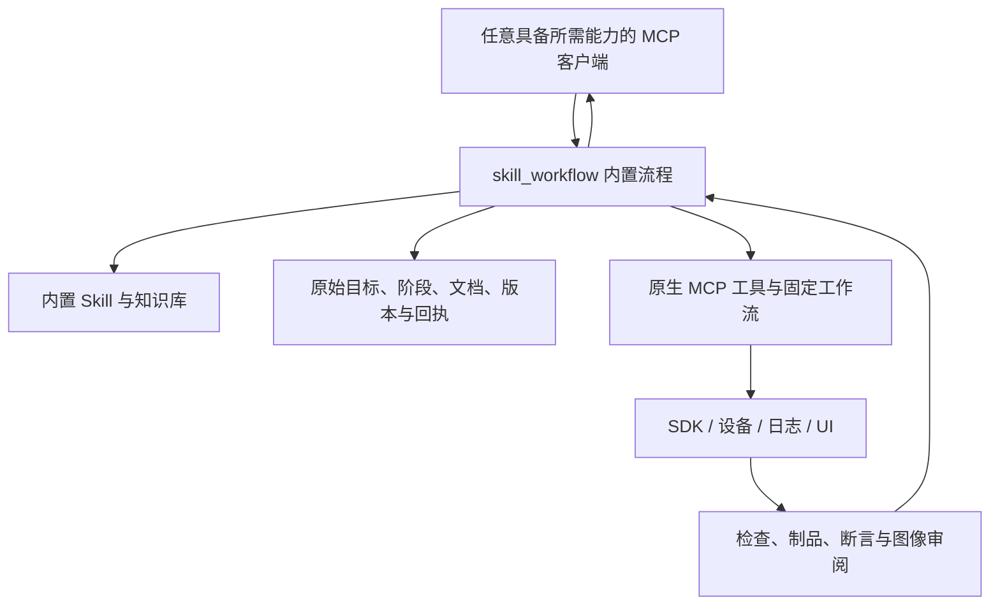

# MCP 内置知识、Skill 与工作流

知识资源、Skill 和流程定义全部随 MCP 包分发。客户端通过标准 MCP 工具接收当前阶段的指导并推进流程，不使用客户端 Skill 目录，也不提供安装、列出安装或移除 Skill 的入口。资源文件存在、流程可恢复和真实业务验收通过分别验证。

MCP 负责资源选择、流程定义、持久状态、原生执行顺序与完成条件；客户端负责语言推理、代码读写和必要的图像理解。客户端能力不足时，相关步骤保持未完成。这一结构不依赖 Codex 的目录或内部模式；跨客户端实际兼容性仍按验证结果报告。

## 入口与执行

1. `workflow_catalog` 同时列出固定原生工作流和 `skill_workflows`。`skill_workflow catalog` 单独返回引导式流程、内置 Skill、知识 ID、阶段和原生验收类别。
2. `skill_workflow start` 提交 `kind`、绝对 `project_path` 和原始 `objective`，可用 `request_key` 去重。`create` 支持尚未创建的目标目录，其他流程使用现有工程。`device` 可固定 `target` 和 `bundle_name`，`ui_test` 必须提供。
3. 响应包含 `run_id`、`revision`、`phase`、`definition_sha256` 和 `guidance`。指导由 MCP 从本包读取，包括完整 Skill 文本、规划阶段的相关知识、其余引用的读取入口、原生工作流 schema 查询和下一步动作。
4. 按指导调用原生 MCP 工具；固定工作流用 `workflow_run start/status/resume/cancel`。需要代码修改或理解证据时由客户端完成，再通过 MCP 更新文档、阶段和证据。
5. `write` 使用 `expected_revision` 保存 `plan.md`、`spec.md`、`tasks.md` 或 `notes.md`。`transition` 按 planning → implementing → verifying → completed 推进，也允许返回早期阶段或取消；每次记录具体理由。不能用新的阶段或文字描述跳过原始要求。
6. 断开或重启后通过 `read` 获取相同目标、文档、阶段和指导。资源定义变化会阻止旧任务继续修改，避免新 Skill 意外改变旧流程。`publish` 仅将文档写入指定的新文件。

| kind      | 内置指导与完成门禁                                                                   |
| --------- | ------------------------------------------------------------------------------------ |
| plan      | 计划、实施和验证记录；协调完成不等于任意业务目标已验证                               |
| debug     | 运行时调查、日志、修复及设备复现；要求成功的设备验证或 UI 流程证据                   |
| spec      | 完整需求/用户场景/验收标准、技术计划和勾选任务；完成须有对应的成功构建或 UI 验证证据 |
| customize | 按所选客户端真实 schema 配置 MCP；不安装 Skill，不假设产品专有模式存在               |
| arkts     | 内置 ArkTS/ArkUI 规则、代码修改、检查和构建                                          |
| repair    | 原始诊断、错误知识、原因修复、重新检查和构建                                         |
| create    | SDK 模板建工程、真实启动入口、实现与构建                                             |
| ui_test   | 固定原始测试步骤、设备动作、图像审阅；要求成功结束的 ui_test                         |

完成门禁检查原生回执是否成功、是否属于所选类别和捕获的项目；没有项目上下文的设备结果必须匹配预先捕获的设备与应用。完成证据的执行时间不能早于最近一次进入 implementing 阶段。回执被引用后，保留策略及手动清理均不能单独删除它；导出父流程会一并导出引用的原生记录与制品，清理时先处理引用方。

这些检查保证回执与流程的关联；客户端仍需依据原始目标判断证据的实际含义。引导式流程保留 `verified=false`，不把任意文字目标直接判定为已验证。原生检查、构建和 UI 测试返回各自的真实结果。

## 内置资源

`skill_manage` 只提供 `catalog`（可用 query 检索和分页）与 `read`（name、可选 file，默认 SKILL.md）。读取返回内容、来源提交、文件摘要和引用读取参数，禁止未登记文件及内容摘要不匹配。六个 Skill 分别覆盖 ArkTS 规范、诊断修复、运行时调试、项目创建、原生工具使用、客户端配置。79 份规则/案例/示例和本地文档库继续由 `harmony_knowledge` 提供，默认本地读取。

Skill 中的相对引用通过 `skill_manage read` 的 file 字段读取；知识分页通过 `harmony_knowledge read` 的 offset 继续。无需复制文件到 `.agents`、`.codex` 或任何其他客户端目录。

## 自然语言 UI 测试

1. ui_test start 捕获原始 test_plan、app、target，必要时 fresh_start。allowed_bundles 可预先声明额外应用（如权限弹窗），display_id 限定显示器。主应用始终包含在作用域内；日志仍只采集主应用。
2. start.steps 或 plan 把需求拆成固定顺序步骤，每步有明确 assert 或视觉 review。计划确定后不能删除要求换取成功。
3. resume 初始化；从新 UI 证据定位。act 使用当前 step_id 和唯一 attempt_id，保存操作前后状态和截图。额外应用须在 selector/window 中明确，不随机选同名节点。
4. check 执行断言并产生 review_id。用 workflow_run read_artifact as=image 读取对应图片，再以 artifact_id、sha256、read_token 和真实观察完成 ui_review。passed/failed/insufficient 均保留；视觉通过不能覆盖失败控件断言。
5. 重复 check 默认复用审阅；界面自行变化或证据不足后，可明确 recapture=true 重新取证，无需重复点击。旧证据保留。
6. 三次节点和画面不变会暂停；全测试最多 200 次动作、每步 40 次、重新规划 20 次。replan 要新策略并完成新截图审阅；相同定位及状态不能仅换一句理由继续。失去回执的动作不会由 resume 重放。
7. 每步原始要求通过且不确定动作已按证据处理后，finish 才返回 verified=true。取消和重启保留已有证据。

logs 按 test_id 列出时间/PID/步骤区间，可用 chunk_id、字面量 search_keywords、offset 和字节 limit。日志是 Hilog 有界环形缓冲区的部分证据，不宣称完整连续采集。report 保存步骤、截图、审阅和日志索引；export 输出至新绝对目录及带摘要 manifest。暂停任务可导出，导出完成不代表测试完成。

## 选择工具与恢复

- 截图用 ui_snapshot mode=image；验证才用 verify_ui 或 ui_test check。
- ui_flow run 只运行保存的流程，不接受录制专属 mode/name；record_start 才需要它们，后续使用 recording_id 和捕获上下文。
- 焦点输入用 ui_control action=text，明确 window 且有唯一已聚焦可编辑控件。inputText 仍是定位后输入。Back/Home/Power 接受大小写别名。
- 保存流程有 200 步/10 分钟上限，三次节点及画面不变会阻止下一动作；原始最终断言仍决定完成。已完成动作通过持久化回执恢复。
- 默认构建前在项目租约内执行完整且新鲜的 ArkTS 检查；阻断诊断修复、复检后再构建。显式编译器调查可用带理由的 preflight manual_override，其结果不冒充检查通过。
- 部署时只临时复制安装输入；安装成功回执持久化后自动释放 MCP 的 HAP/HSP 副本，只保留摘要和回执。结果不确定时保留恢复输入，后续启动或 UI 恢复不重复安装。源项目产物不删除。导出中的 released_packages 明确标记已释放包。
- workflow_run capacity 预估下次制品；导出应保留的完成任务，再 cleanup_plan 审查 run_ids 和 plan_hash，最后 cleanup_apply。满额仍允许恢复入口和取消，活动任务、待恢复任务及导出引用继续受保护。常规成功部署不应依靠这套手动流程来释放安装包。
# UI 进展检测补充

`ui_test` 与保存流程回放以目标应用节点及捕获到的应用窗口像素共同判断变化。窗口边界从本次 UI 树读取并按截图缩放映射，不采用固定状态栏高度；窗口之外的时钟或系统图标变化不能重置无进展计数。完整原始截图及其 SHA-256 仍保留供视觉审阅和导出，应用内部仅画布像素变化也会被识别。无法确定窗口范围或有界解码失败时停止当前操作，不降级为全屏变化判断。连续三次无进展后要求重新规划；新策略仍必须经过新截图审阅，不能借重规划重复相同操作与定位器。
