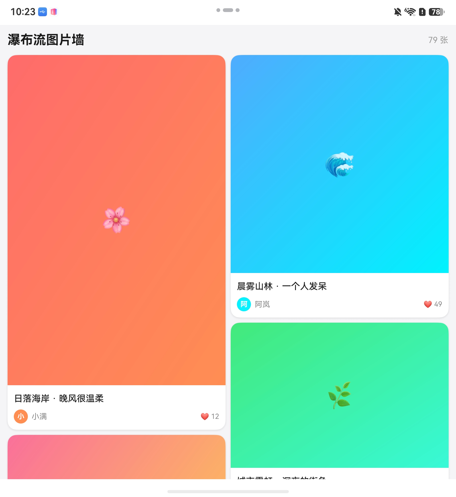

# 基础扩展场景

## SCENE-01 组件工厂动态分发场景

**适用场景：** 同一容器需要根据数据中的 `type` 字段渲染多种 UI 变体（典型如新闻信息流中的纯文本 / 单图 / 三图 / 视频四种 item、消息列表中的系统通知 / 用户消息 / 红包 / 文件等），且希望新增一种类型时无需修改调用方代码。通过把「类型 → 渲染逻辑」的映射下沉到一个集中注册的工厂，调用方只负责按类型取出构造器并执行，新增类型只需在工厂注册表中追加一行。

**核心机制：** ArkUI 的 `@Builder` 本身是函数声明，不能作为一等值存储或传递；`wrapBuilder` 把全局 `@Builder` 包装为 `WrappedBuilder<[P]>` 类型的可存储值，从而能放入 `Map`、作为参数传递、在运行时按 key 取出后调用其 `.builder(param)` 触发渲染。这是工厂模式能在 ArkUI 中落地的底层基础。

**选型决策树：**

1. **变体数量是否会持续增长？** 是（业务上明确会陆续新增类型）→ 用组件工厂集中注册
2. **变体类型固定且很少变化？** 是（如固定的 2-3 种且不会扩展）→ 直接 `if/else` 即可，无需工厂
3. **是否需要按运行时数据动态决定渲染逻辑？** 是（如服务端下发 type 字段）→ 工厂的注册表查询能力天然契合

### 应用场景：新闻信息流多类型 item 列表

实现一个新闻列表，包含 4 种 item 变体，按以下 5 步逐步搭建工厂。

#### 步骤 1：定义带 type 鉴别字段的数据模型

数据模型必须包含一个枚举 `type` 字段作为工厂查找的 key，其余字段为变体共用的基础信息加可选字段（如视频时长 `duration` 只在视频类型中使用）：

```typescript
// 来源：entry/src/main/ets/model/NewsModel.ets

export enum NewsItemType {
  TEXT = 'text',
  SINGLE_IMAGE = 'singleImage',
  MULTI_IMAGE = 'multiImage',
  VIDEO = 'video'
}

export interface NewsItem {
  id: string;
  type: NewsItemType;             // 工厂查找 key
  title: string;
  source: string;
  time: string;
  images: ResourceStr[];
  commentCount: number;
  duration?: string;              // 仅视频类型使用
}
```

#### 步骤 2：为每个变体编写全局 @Builder

`wrapBuilder` 只能包装「全局 `@Builder` 函数」，不能用箭头函数、不能是类成员方法，因此每个变体都按规范声明为顶层 `function`。函数签名统一为 `(item: NewsItem) => void`，方便工厂统一存储：

```typescript
@Builder
function NewsTextItemView(item: NewsItem) {
  // ...
}

@Builder
function NewsSingleImageView(item: NewsItem) {
  // ...
}

// 三图视图、视频视图、兜底视图的实现结构类似,略

// 通过 wrapBuilder 包装为可被工厂存储 / 传递的「一等值」
export const newsTextBuilder: WrappedBuilder<[NewsItem]> = wrapBuilder(NewsTextItemView);
export const newsSingleImageBuilder: WrappedBuilder<[NewsItem]> = wrapBuilder(NewsSingleImageView);
export const newsMultiImageBuilder: WrappedBuilder<[NewsItem]> = wrapBuilder(NewsMultiImageView);
export const newsVideoBuilder: WrappedBuilder<[NewsItem]> = wrapBuilder(NewsVideoView);
export const newsDefaultBuilder: WrappedBuilder<[NewsItem]> = wrapBuilder(NewsUnknownView);
```

#### 步骤 3：实现通用 ComponentFactory 类

工厂本体是泛型类，与具体业务（新闻）解耦——任何 `type → @Builder` 的场景都能复用。核心 API：`register` 链式注册、`setDefault` 设置兜底、`get` 按 key 查询（未命中走 fallback）：

```typescript
export class ComponentFactory<K, P extends Object> {
  private readonly builders: Map<K, WrappedBuilder<[P]>> = new Map<K, WrappedBuilder<[P]>>();
  private fallback: WrappedBuilder<[P]> | undefined = undefined;
  private readonly namespace: string;

  constructor(namespace: string = 'default') {
    this.namespace = namespace;
  }

  /** 注册一个构造器,返回 this 支持链式调用 */
  register(key: K, builder: WrappedBuilder<[P]>): ComponentFactory<K, P> {
    if (this.builders.has(key)) {
      console.warn(`duplicate key "${String(key)}" will be overwritten`);
    }
    this.builders.set(key, builder);
    return this;
  }

  /** 设置兜底构造器,未命中 get(key) 时返回,避免渲染空白 */
  setDefault(builder: WrappedBuilder<[P]>): ComponentFactory<K, P> {
    this.fallback = builder;
    return this;
  }

  /** 按 key 查找;未命中返回 fallback(可能为 undefined) */
  get(key: K): WrappedBuilder<[P]> | undefined {
    const builder = this.builders.get(key);
    if (builder) {
      return builder;
    }
    return this.fallback;
  }

  has(key: K): boolean { return this.builders.has(key); }
  unregister(key: K): boolean { return this.builders.delete(key); }
  clear(): void { this.builders.clear(); this.fallback = undefined; }
  size(): number { return this.builders.size; }
}
```

#### 步骤 4：构造业务工厂单例并集中注册变体

业务层只需要实例化一个工厂单例、用链式调用注册所有变体、并设置一个兜底构造器（兜底用于未命中注册表时的降级展示，避免出现空白 item）。注册时机选在模块加载时（顶层语句），保证页面 build 之前注册表已就绪：

```typescript
import { ComponentFactory } from '../../factory/ComponentFactory';
import { NewsItem, NewsItemType } from '../../model/NewsModel';
import {
  newsDefaultBuilder,
  newsMultiImageBuilder,
  newsSingleImageBuilder,
  newsTextBuilder,
  newsVideoBuilder
} from './NewsItemBuilders';

/** 新闻列表组件工厂单例 */
export const newsComponentFactory: ComponentFactory<NewsItemType, NewsItem> = new ComponentFactory<
  NewsItemType,
  NewsItem
>('News');

// 模块加载时集中注册:新增类型只需在此追加一行 register
newsComponentFactory
  .register(NewsItemType.TEXT, newsTextBuilder)
  .register(NewsItemType.SINGLE_IMAGE, newsSingleImageBuilder)
  .register(NewsItemType.MULTI_IMAGE, newsMultiImageBuilder)
  .register(NewsItemType.VIDEO, newsVideoBuilder)
  .setDefault(newsDefaultBuilder);
```

#### 步骤 5：在调用方组件中按 type 取出并执行

调用方组件不再用 `switch` 分发，而是从工厂取出 `WrappedBuilder` 并调用其 `.builder(item)` 触发渲染。关键工程要点：

- **抽取独立 `@Component` 承载分发**：`WrappedBuilder.builder()` 必须在组件 `build()` 上下文中调用，单独抽出一个 `NewsItemHost` 让数据变化能精确触发 build 重算并分发到正确变体
- **build() 中的 if 必须在容器内**：ArkTS 规定 build() 的单一根节点必须是容器组件，因此 `if (wrapped)` 必须包在 `Column()` 等容器内部；`wrapped` 可作为类成员提前求值

```typescript
@Entry
@ComponentV2
struct NewsListPage {
  private newsList: NewsItem[] = mockNews();

  build() {
    Column() {
      Text('新闻信息流 · 组件工厂示例')
        .fontSize(18).fontWeight(FontWeight.Bold).width('100%').padding(16)

      List({ space: 8 }) {
        ForEach(this.newsList, (item: NewsItem) => {
          ListItem() {
            // ...
            newsComponentFactory.get(item.type)?.builder(item)
            // ...
          }
        }, (item: NewsItem) => item.id)
      }
      .width('100%').layoutWeight(1).backgroundColor('#F5F5F5')
    }
    .width('100%').height('100%')
  }
}
```

#### 步骤 6（重要）：让工厂构建的 UI 随数据「动态刷新」—— 必须按引用传递

步骤 5 的 `builder(item)` 能完成「按 type 分发」，但 `WrappedBuilder.builder(param)` 走的是 ArkUI `@Builder` 的参数传递规则——**默认按值传递**。当数据属性后续发生变化时（例如 `commentCount` 自增、`duration` 更新），按值传递**不会**让 @Builder 内的 UI 跟着刷新。要让组件工厂构建的 UI 随数据动态刷新，必须改用**按引用传递**。

**ArkUI `@Builder` 参数传递规则（官方）：**

| 传递方式 | 触发条件 | 状态变量/属性级变化是否刷新 @Builder 内 UI |
| --- | --- | --- |
| **按值传递（默认）** | 传「整个对象变量」，如 `builder(this.item)` | ❌ 不刷新（只有对象**整体重新赋值**才刷新） |
| **按引用传递** | 只传**一个参数**，且该参数直接是**对象字面量** | ✅ 刷新 |
| 按回调传递 | 复杂嵌套对象场景 | ✅ 刷新 |

**正确写法**：把数据以**对象字面量**形式、作为**唯一参数**传给 `.builder(...)`，枚举出需要被观察的字段——每个字段都成为框架持续观察的「观察点」，属性级变化能精确触发工厂构建的 UI 刷新。注意宿主组件需用状态装饰器（V1 `@State` / V2 `@Param`）持有数据，变化才会驱动 build 重算并重新走工厂分发：

```typescript
// NewsReusableItem.ets（V1 宿主组件）
@Reusable
@Component
export struct NewsReusableItem {
  @State item: NewsItem = createEmptyNewsItem();

  aboutToReuse(params: Record<string, Object>): void {
    this.item = params.item as NewsItem;
  }

  build() {
    Column() {
      // ✅ 按引用传递：唯一参数 + 对象字面量，逐字段枚举需要响应变化的字段
      newsComponentFactory.get(this.item.type)?.builder({
        id: this.item.id,
        type: this.item.type,          // 工厂查找 key
        title: this.item.title,
        source: this.item.source,
        time: this.item.time,
        images: this.item.images,
        commentCount: this.item.commentCount,
        duration: this.item.duration
      })
    }
  }
}
```

**三个易踩的坑**：

1. **不要写 `builder(this.item)`**：传整个对象变量是按值传递，`this.item.commentCount` 这类属性级变化不会刷新工厂 UI（只有 `this.item = 新对象` 整体替换才刷新）。
2. **按引用传递只在「单参数 + 对象字面量」时生效**：若 @Builder 有多个参数（如 `builder(a, b)`），即使其中一个是对象字面量也不支持按引用刷新——此时把所有字段收进一个对象字面量、只传一个参数。
3. **不要混用按值与按引用**：同一次 @Builder 调用里同时出现「对象变量」与「对象字面量」两种传参，会直接导致动态渲染失效。统一用对象字面量枚举字段即可。

---

## SCENE-02 自定义布局容器场景

**适用场景：** 系统内置容器（Row/Column/Grid/WaterFlow 等）无法满足布局规则时，典型如「双列等宽不等高的瀑布流 + 卡片可跨行跨列 + 拖拽挤位重排」「按业务规则手工排版」「测量阶段需把子组件测量结果汇总后反算容器自身尺寸，再回写父容器高度」。此时需通过 `onMeasureSize` 接管子组件测量与容器尺寸计算、通过 `onPlaceChildren` 接管子组件位置放置，两阶段协作完成一次完整布局。本场景采用 `@ComponentV2` 实现。

**核心机制：**

- **`@BuilderParam` + 占位 `build()` 是自定义容器的基础**：容器组件用 `@BuilderParam builder` 接收调用方传入的子树，自身 `build()` 只调用 `this.builder()` 把子树挂进来——容器本身不关心子组件是什么，只负责在两个回调里给它们测量和定位
- **V2 单向数据流:用 `@Param` 接收尺寸、`@Event` 反向回传**：与 V1 用 `@StorageLink` 直接写全局存储不同，V2 中父组件通过 `@Param deviceCardHeight` 把当前总高传入子组件（只读），子组件测量出新总高后通过 `@Event onHeightChange` 回调通知父组件，由父组件更新 `@Local` 状态——这种「数据向下、事件向上」的模式是 V2 自定义布局回写尺寸的推荐做法
- **测量阶段（`onMeasureSize`）只产尺寸、不产位置**：通过 `child.measure({})` 触发每个子组件的测量，结果存入 `child.measureResult`；该回调的返回值 `SizeResult` 决定容器自身占多大
- **放置阶段（`onPlaceChildren`）读 `measureResult` 算位置**：测量结果在该阶段以 `child.measureResult.width / height` 形式可读，配合自定义算法计算每个子组件的 `x/y`，再调 `child.layout({ x, y })` 落位
- **算法与框架解耦**：把「位置计算」抽成纯算法类（如 `RowPlanner`），「应用位置」抽成填充类（如 `ColumnFiller`），自定义布局回调只编排两者，便于单测与替换

**选型决策树：**

1. **能用系统容器解决吗？** 是 → 直接用 Row/Column/Grid/WaterFlow，不要自造轮子
2. **是否需要根据子组件实际测量结果动态算位置？** 是（如瀑布流按列高选短边、流式布局按行宽换行）→ 必须走 `onMeasureSize` + `onPlaceChildren`
3. **布局规则是否会随业务演化？** 是（如新增卡片尺寸、新增列数）→ 把规则抽成独立 Planner 类，回调里只编排
4. **跨页面共享总高？** 否 → `@Param + @Event` 单向同步即可；是 → 把 `@Local` 替换为 `AppStorageV2.connect(Holder, 'key', () => new Holder())`，其中 `Holder` 是包装了 `value: number` 的 class（V2 的 `AppStorageV2` 只支持 class 类型，不支持基础类型直存）

### 应用场景：双列瀑布流拖拽卡片墙

实现一个 1×2 / 2×2 混排的双列卡片墙，卡片可长按拖拽挤位重排。布局核心：每次插入新卡片时选择当前较短的一列追加，容器总高度跟随最长列动态变化。



#### 步骤 1：定义占位 Builder 与容器骨架（V2）

V2 自定义容器与 V1 的关键差异：用 `@ComponentV2` 替代 `@Component`；外部传入的总高通过 `@Param`（只读）接收，反向回写通过 `@Event` 通知——而不是 `@StorageLink` 直接写全局存储。容器仍需 `result: SizeResult` 成员存储自测量结果，供框架读取：

```typescript
@ComponentV2
struct CustomLayout {
  // V2:用 @Param 接收父组件传入的当前总高(只读,子组件不能直接修改)
  @Param deviceCardHeight: number = 1;
  // V2:用 @Event 暴露总高变化回调,测量出新值后通知父组件更新
  @Event onHeightChange: (height: number) => void = (height: number) => {};

  @LocalBuilder
  doNothingBuilder() {
  };

  @BuilderParam builder: () => void = this.doNothingBuilder;
  result: SizeResult = {
    width: 0,
    height: 0
  };

  // onMeasureSize / onPlaceChildren 见后续步骤

  build() {
    this.builder()
  }
}
```

#### 步骤 2：onMeasureSize —— 触发子组件测量并产出容器尺寸

测量阶段必须对每个 `Measurable` 子组件调用 `measure({})`，否则后续 `measureResult` 为空导致放置阶段读到 0。返回值决定容器自身尺寸——本例中容器宽度等于屏宽减左右边距，高度由 `@Param` 注入的 `deviceCardHeight` 驱动：

```typescript
onMeasureSize(selfLayoutInfo: GeometryInfo, children: Array<Measurable>, constraint: ConstraintSizeOptions) {
  children.forEach((child: Measurable) => {
    // 必须调用 measure 触发子组件测量,否则 measureResult 为空
    child.measure({})
  })
  // 卡片容器组件的宽高信息
  this.result.width = this.getDeviceCardViewWidth() - CardInfo.CARD_MARGIN_SCREEN * 2;
  this.result.height = this.deviceCardHeight;   // 读 @Param 注入值
  return this.result;
}
```

> **关键点：** `child.measure({})` 的入参是 `ConstraintSizeOptions`，传 `{}` 表示子组件按自身声明的宽高（如 `width(this.midCardWidth)`）自由测量；若需要父容器约束子组件（如限定最大宽），应传 `{ maxWidth: ... }`。

#### 步骤 3：抽象布局算法 —— RowPlanner（贪心选短列）

把「列选择 + 坐标计算」从放置回调中剥离成纯算法类，输入是子组件测量尺寸数组，输出是每个子组件的落位坐标。本例用「两列高度数组 `colHeights`，每次选当前较短列」的贪心策略。算法类与组件解耦，V1/V2 实现完全一致：

```typescript
interface CardMetrics {
  width: number
  height: number
}

interface PlannableCard extends CardMetrics {
  child: Layoutable
}

interface Placement {
  child: Layoutable
  column: number
  x: number
  y: number
}

class RowPlanner {
  private colHeights: number[] = [0, 0]
  private colX: number[]
  private gap: number

  constructor(screenMargin: number, gap: number, cardMaxWidth: number) {
    this.gap = gap
    // 两列的 X 坐标:左列贴左边距,右列在屏宽中点偏移 gap/2
    this.colX = [screenMargin, screenMargin + cardMaxWidth / 2 + gap / 2]
  }

  plan(cards: PlannableCard[]): Placement[] {
    const placements: Placement[] = []
    cards.forEach(card => {
      // 贪心:选择当前总高度较小的一列追加,保证两列尽量平衡
      const column = this.colHeights[0] <= this.colHeights[1] ? 0 : 1
      const y = this.colHeights[column]
      placements.push({ child: card.child, column, x: this.colX[column], y })
      this.colHeights[column] = y + card.height + this.gap
    })
    return placements
  }

  totalHeight(): number {
    // 容器总高度 = 较长列高度 - 末尾 gap
    return Math.max(this.colHeights[0], this.colHeights[1]) - this.gap
  }
}
```

#### 步骤 4：onPlaceChildren —— 读测量结果、调算法、应用位置、事件回传

放置阶段是测量与渲染的桥梁：从 `child.measureResult` 读出步骤 2 中 `measure({})` 产出的尺寸 → 喂给 `RowPlanner.plan` → 拿到每个子组件的 `x/y` → 调 `child.layout({ x, y })` 落位。最后通过 `@Event onHeightChange` 把新总高回传给父组件——V2 单向数据流的关键：子组件不直接写全局状态，而是发事件让父组件决定如何更新：

```typescript
onPlaceChildren(selfLayoutInfo: GeometryInfo, children: Array<Layoutable>, constraint: ConstraintSizeOptions) {
  const maxWidth = Number.parseFloat(constraint.maxWidth?.toString() ?? '0')
  const cardMaxWidth = maxWidth - CardInfo.CARD_MARGIN_SCREEN * 2
  const planner = new RowPlanner(
    CardInfo.CARD_MARGIN_SCREEN,
    CardInfo.CARD_MARGIN,
    cardMaxWidth
  )
  // 1. 从 measureResult 收集每个子组件的实际尺寸
  const cards: PlannableCard[] = []
  children.forEach(child => {
    cards.push({
      child: child,
      width: child.measureResult.width,
      height: child.measureResult.height
    })
  })
  // 2. 交给算法计算每个子组件的落位
  const placements = planner.plan(cards)
  // 3. 应用位置:调 child.layout 写入 x/y
  new ColumnFiller().apply(placements)
  // 4. V2:通过 @Event 反向回传新总高,由父组件更新 @Local 状态,下一帧 onMeasureSize 读到新值
  this.onHeightChange(planner.totalHeight())
}

class ColumnFiller {
  apply(placements: Placement[]): void {
    placements.forEach(p => {
      p.child.layout({ x: p.x, y: p.y })
    })
  }
}
```

#### 步骤 5：调用方组件通过 @BuilderParam 注入子树（V2）

调用方改为 `@ComponentV2`，列表数据用 `@Local` 声明，总高作为本地状态被子组件通过事件回写。在 `CustomLayout` 的初始化参数中同时传入 `deviceCardHeight`（向下数据）与 `onHeightChange` 回调（向上事件），V2 通过这种显式的「参数 + 事件」配对替代 V1 的 `@StorageLink` 双向绑定。拖拽挤位时只需修改 `deviceLists` 数组顺序（`splice` 实现），CustomLayout 会自动重新触发 `onMeasureSize` + `onPlaceChildren` 重新排版：

```typescript
@Entry
@ComponentV2
struct DragGrid {
  // V2:内部状态用 @Local
  @Local deviceLists: DeviceCardItemEntity[] = []
  // V2:总高作为本地状态,通过 @Event 被子组件更新,从而驱动外层 Column 高度刷新
  @Local deviceCardHeight: number = 1;
  // 卡片尺寸常量(初始化后不再变化,用普通成员即可,无需 @Local)
  smallCardWidth: number = 0;
  smallCardHeight: number = 0;
  midCardWidth: number = 0;
  midCardHeight: number = 0;

  build() {
    Column() {
      Column() {
        CustomLayout({
          // 向下:把当前总高传给子组件(对应 @Param deviceCardHeight)
          deviceCardHeight: this.deviceCardHeight,
          // 向上:子组件测量出新总高后回调,更新本地状态(对应 @Event onHeightChange)
          onHeightChange: (height: number) => {
            this.deviceCardHeight = height;
          }
        }) {
          ForEach(this.deviceLists, (item: DeviceCardItemEntity, index: number) => {
            if (item) {
              Column() {
                DeviceCommonComponent({ itemEntity: item, deviceLists: this.deviceLists, index: index })
              }
              // 子组件自身的尺寸声明,会被 measure({}) 读到 measureResult
              .height(item.cardSize === CardSize.SMALL_CARD ? this.smallCardHeight : this.midCardHeight)
              .width(item.cardSize === CardSize.SMALL_CARD ? this.smallCardWidth : this.midCardWidth)
            }
          }, (item: DeviceCardItemEntity) => `${item.id}-${item.cardSize}`)
        }
      }
      .width('100%')
      .height(this.deviceCardHeight)   // 跟随 @Local 更新,触发外层 Column 高度刷新
    }
    .height('100%').width('100%')
  }
}
```

---
