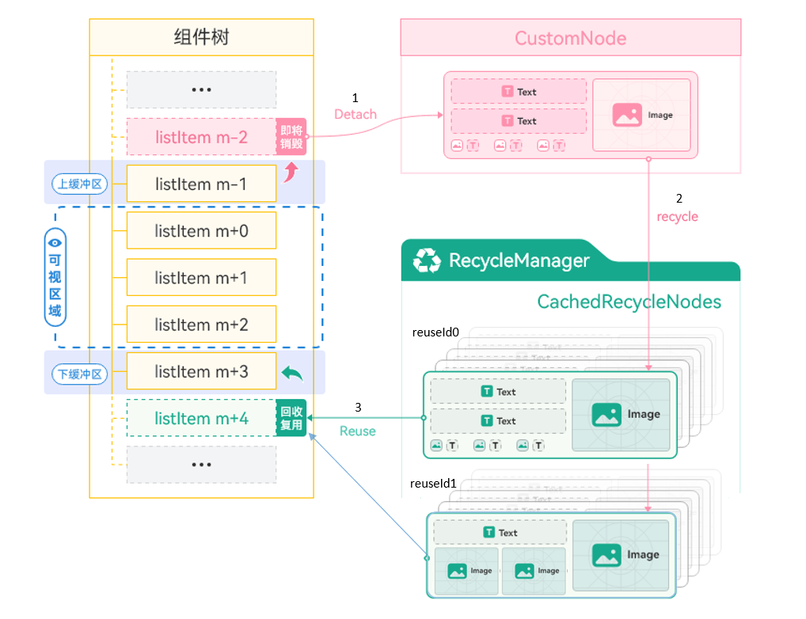
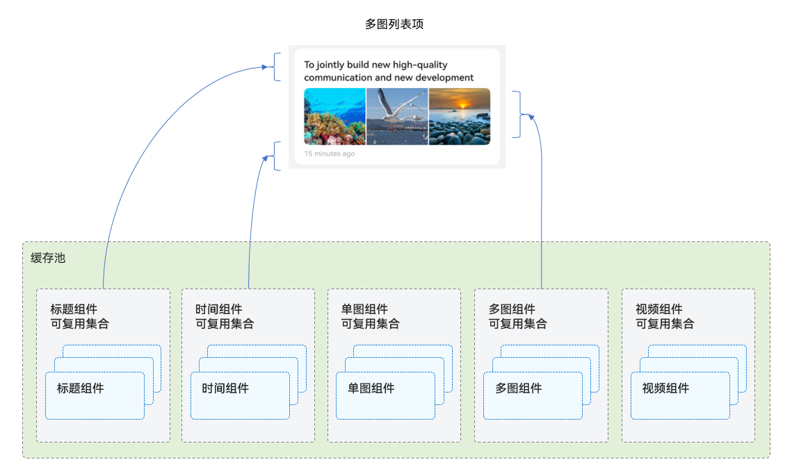
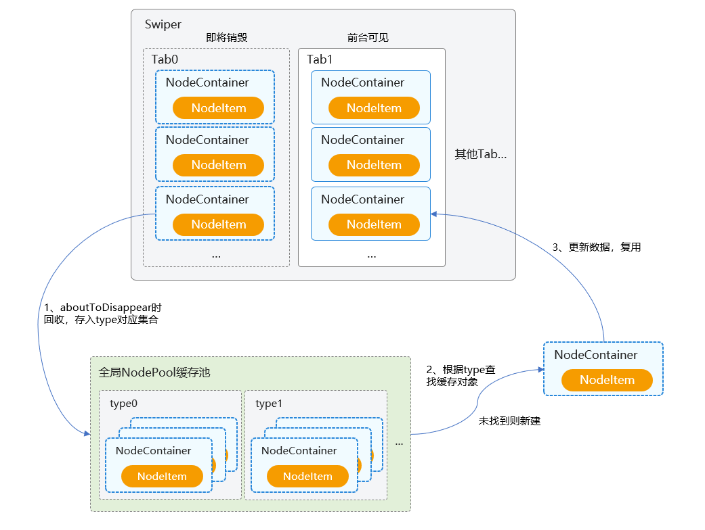
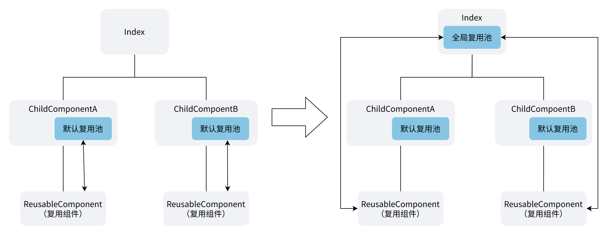
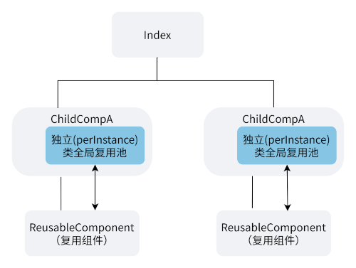
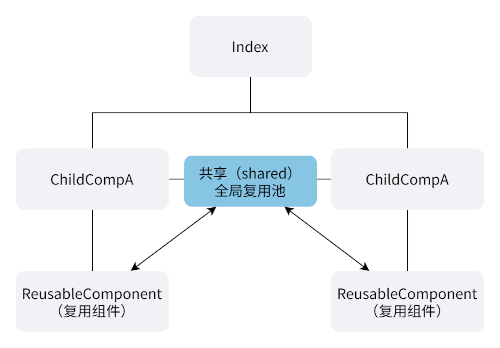


# 基础复用场景

**组件复用整体架构：**


关键 API（V1 / V2）：

- `@Reusable` / `@ReusableV2`：标记组件可进入复用池（`@ReusableV2` 需 API 18+）
- `reuseId`：相同 ID 共享一个复用池，不传时默认以组件名为 ID；V1 用 `.reuseId('xxx')`，V2 用 `.reuse({ reuseId: () => 'xxx' })`
- 数据更新：V1 用 `@State` + 手动 `aboutToReuse(params)`；V2 用 `@Param` 自动重置

## SCENE-01 单类型列表项复用场景

**适用场景：** 列表中所有 item 布局完全一致（如统一结构的消息项、商品卡片、公告条目），且数据量较大需要长列表滚动。直接用 `ForEach` 会在数据变化时全量重建子组件；用 `LazyForEach` 配合可复用组件可让滚出可视区的组件实例进入复用池，下次需要时直接复用并更新数据，避免反复创建/销毁带来的帧率抖动与内存抖动。

**核心机制：** 组件实例滚出可视区域后不销毁，而是进入对应组件的复用池（默认以组件名为复用池标识）；下次需要相同组件时直接从池中取出复用。数据更新方式因状态管理版本而异：

- **V1（`@Reusable` + `@Component`）**：框架回调 `aboutToReuse(params)`，开发者手动把新数据赋值给 `@State`
- **V2（`@ReusableV2` + `@ComponentV2`，API 18+）**：复用前框架自动用本次调用传入的新值重置 `@Param`，无需手动赋值（V2 提供 `aboutToRecycle` / `aboutToReuse` 生命周期回调，均无入参，仅用于副作用）

**实现步骤：**

1. **声明可复用子组件**：V1 用 `@Reusable` + `@Component`、`@State` 声明随数据变化的字段；V2 用 `@ReusableV2` + `@ComponentV2`、`@Param` 声明（字段如 `title` / `from` / `tail`，类型与父级传入一致）
2. **实现数据更新**：V1 重写 `aboutToReuse(params: Record<string, Object>)` 逐字段赋值给 `@State`；V2 由 `@Param` 自动重置，无需重写
3. **渲染列表**：V1 用 `LazyForEach(dataSource, item => 子组件({...字段}), item => 键)`（数据源为 `IDataSource`）；V2 推荐 `Repeat(items).virtualScroll().each(ri => ListItem { 子组件({...ri.item...}) })`（数据源为数组）。配合 `cachedCount(1)` 控制预渲染范围，超出范围的组件实例进入复用池

**V1 代码：**

```typescript
// ① 用 @Reusable 标记可复用组件，@State 声明随数据变化的字段
@Reusable
@Component
struct ItemView {
  @State title: string | Resource = '';
  @State from: string | Resource = '';
  @State tail: string | Resource = '';

  // ② 重写 aboutToReuse：组件被复用前从 params 取出新数据赋值给 @State
  aboutToReuse(params: Record<string, Object>): void {
    this.title = params.title as string;
    this.from = params.from as string;
    this.tail = params.tail as string;
  }

  build() {
    Column() {
      Text(this.title)
      Row() {
        Text(this.from)
        Text(this.tail)
      }
    }
  }
}

@Component
export struct OneTypeItemPage {
  private dataSource: ItemDataSource = new ItemDataSource();

  aboutToAppear(): void {
    this.dataSource.pushArray(genMockItemData(1000));
  }

  build() {
    NavDestination() {
      List() {
        LazyForEach(this.dataSource, (item: ItemData) => {
          // ③ 调用子组件传入字段（默认按组件名 ItemView 复用）
          ItemView({ title: item.title, from: item.from, tail: item.tail })
        }, (item: ItemData) => item.id.toString())
      }
      // ③ cachedCount(1) 控制预渲染范围，超出范围的实例进入默认复用池
      .cachedCount(1)
    }
  }
}
```

**V2 代码：**

```typescript
// ① 用 @ReusableV2 标记可复用组件（需 @ComponentV2），@Param 声明随数据变化的字段
@ReusableV2
@ComponentV2
struct ItemView {
  @Param title: string | Resource = '';
  @Param from: string | Resource = '';
  @Param tail: string | Resource = '';

  // ② V2 复用生命周期回调（均无入参）：复用时触发 aboutToReuse、回收时触发 aboutToRecycle
  // @Param 在复用时自动用新入参重置，无需手动赋值

  build() {
    Column() {
      Text(this.title)
      Row() {
        Text(this.from)
        Text(this.tail)
      }
    }
  }
}

@ComponentV2
export struct OneTypeItemPage {
  @Local items: ItemData[] = [];

  aboutToAppear(): void {
    this.items = genMockItemData(1000);
  }

  build() {
    NavDestination() {
      List() {
        // ③ V2 用 Repeat + virtualScroll 代替 LazyForEach（数据源是数组，而非 IDataSource）
        Repeat<ItemData>(this.items)
          .virtualScroll()
          .each((ri: RepeatItem<ItemData>) => {
            ListItem() {
              // 调用子组件传入字段（默认按组件名 ItemView 复用）
              ItemView({ title: ri.item.title, from: ri.item.from, tail: ri.item.tail })
            }
          })
      }
      // ③ cachedCount(1) 控制预渲染范围，超出范围的实例进入默认复用池
      .cachedCount(1)
    }
  }
}
```

---

## SCENE-02 组合型列表项复用场景

**适用场景：** 列表中存在多种布局类型（单图、三图、视频等），且不同类型之间存在结构重叠（所有类型都共用相同的标题区与底部信息区，仅中间内容区不同）。若为每种类型独立编写一个完整的 `@Reusable` 组件，重叠的标题区/底部区会在各自的复用池中被重复创建，导致节点数膨胀、复用率低下。通过「拆分共享段 + 切换差异段」的组合复用模式，让共享段跨类型落入同一复用池，仅差异段按类型各自复用。

**与单类型/多类型复用的区别：**

- **单类型复用**（见 SCENE-01）：整个 list item 是一个 `@Reusable` 组件，以组件名为复用池标识；适合列表中只有一种布局的场景
- **多类型复用**：每种布局类型是一个独立的 `@Reusable` 组件，以组件名为复用池标识，不同类型之间互不复用；适合多布局且彼此结构差异大的场景
- **组合型复用**：list item 被拆成多个 `@Reusable` 子组件（如 Top/Middle/Bottom），同名子组件跨类型自动共享同一个复用池；不同 type 通过切换 Middle 子组件 + 复用 Top/Bottom 子组件拼装而成；适合多布局但存在公共结构（头/尾）的场景

**核心机制：** 组件实例滚出可视区域后不销毁，而是进入对应组件的复用池（默认以组件名为复用池标识）；下次需要相同组件时直接从池中取出复用，避免重复创建/销毁。组合复用把 list item 拆成多个 `@Reusable` 子组件，靠「同名组件入同一池」自动完成复用池划分：跨类型相同的部分（TopView/BottomView）是同一个组件，所有 type 共享同一批标题/底部节点；中间差异段（MiddleSingleImageView/MiddleThreeImageView/MiddleVideoView）是不同组件，各自独立复用。数据更新方式：V1 用 `@Reusable` + `@ObjectLink` + 带参 `aboutToReuse(params)`；V2 用 `@ReusableV2` + `@Param`，复用时自动重置（另可重写无参 `aboutToReuse`/`aboutToRecycle` 做副作用）。

**组合型复用架构：**


**实现步骤：**

1. **声明数据模型**：列表项数据类含 `type`（用于分派布局）及各子组件渲染数据（`title` / `tail` / `preview` / `pics` / `duration` 等）；V1 用 `@Observed`、子组件用 `@ObjectLink` 接收；V2 用 `@ObservedV2` + `@Trace`、子组件用 `@Param` 接收，保证属性变化精准驱动 UI 刷新
2. **拆分可复用子组件**：识别跨类型重叠结构（TopView 标题区、BottomView 尾部区）与类型独有结构（MiddleXxxView 内容区），分别声明为独立可复用组件——V1 用 `@Reusable @Component` + `@ObjectLink item`；V2 用 `@ReusableV2 @ComponentV2` + `@Require @Param item`
3. **复用池划分（由组件名自动决定）**：每个组件默认以组件名为复用池标识——TopView/BottomView 是同一组件，跨所有 type 共享一个池；MiddleSingleImageView/MiddleThreeImageView/MiddleVideoView 是不同组件，各自独立池
4. **声明组合用的 `@LocalBuilder`**：针对每种 `item.type` 编写一个 `@LocalBuilder`（如 `itemBuilderSingleImage` / `itemBuilderThreeImage` / `itemBuilderVideoImage`），内部按 Top → Middle → Bottom 顺序调用对应子组件；Middle 部分根据类型切换不同子组件
5. **渲染列表并按 type 分派 Builder**：根据 `item.type` 调用对应 `@LocalBuilder` 组装出该类型的完整 list item；V1 用 `LazyForEach(IDataSource)`、V2 用 `Repeat(数组).virtualScroll().each()`，配合 `cachedCount(1)` 控制预渲染范围，超出范围的组件实例自动进入对应组件的复用池

**V1 代码：**

```typescript
// ① 声明 @Observed 数据模型：type 字段用于分派布局，其余字段供各子组件渲染
@Observed
export class ItemData {
  id: string = '';
  title: string | Resource = '';
  tail: string | Resource = '';
  type: number = 0;            // 0=单图 1=三图 2=视频
  pics: Resource[] = [];
  preview: Resource | string = '';
  duration: string = '';
}

// ② 拆分子组件 - 标题区 / 尾部区（TopView/BottomView 跨 type 共享，同名自动入同一池）
@Reusable @Component
struct TopView {
  @ObjectLink item: ItemData;
  build() { Text(this.item.title) }
}
@Reusable @Component
struct BottomView {
  @ObjectLink item: ItemData;
  build() { Text(this.item.tail) }
}

// ② 拆分子组件 - 内容区（各 type 专用，不同组件各自独立池）
@Reusable @Component
struct MiddleSingleImageView {
  @ObjectLink item: ItemData;
  build() { Image(this.item.preview) }
}
@Reusable @Component
struct MiddleThreeImageView {
  @ObjectLink item: ItemData;
  build() {
    Row() {
      Image(this.item.pics[0]).layoutWeight(1)
      Image(this.item.pics[1]).layoutWeight(1)
      Image(this.item.pics[2]).layoutWeight(1)
    }
  }
}
@Reusable @Component
struct MiddleVideoView {
  @ObjectLink item: ItemData;
  build() {
    Stack() {
      Image(this.item.preview)
      Text(this.item.duration)
    }
  }
}

@Component
export struct ComposableItemPage {
  private dataSource: ItemDataSource = new ItemDataSource();

  aboutToAppear(): void {
    this.dataSource.pushArray(genMockItemData(1000));
  }

  // ④ 声明组合用的 @LocalBuilder：按 Top → Middle → Bottom 顺序拼装各 type 的 list item
  @LocalBuilder itemBuilderSingleImage(item: ItemData) {
    TopView({ item: item })
    MiddleSingleImageView({ item: item })
    BottomView({ item: item })
  }
  @LocalBuilder itemBuilderThreeImage(item: ItemData) {
    TopView({ item: item })
    MiddleThreeImageView({ item: item })
    BottomView({ item: item })
  }
  @LocalBuilder itemBuilderVideoImage(item: ItemData) {
    TopView({ item: item })
    MiddleVideoView({ item: item })
    BottomView({ item: item })
  }

  build() {
    NavDestination() {
      List() {
        LazyForEach(this.dataSource, (item: ItemData) => {
          ListItem() {
            Column() {
              // ⑤ 按 item.type 分派对应的 @LocalBuilder 组装 list item
              if (item.type === 0) {
                this.itemBuilderSingleImage(item)
              } else if (item.type === 1) {
                this.itemBuilderThreeImage(item)
              } else if (item.type === 2) {
                this.itemBuilderVideoImage(item)
              }
            }
          }
        }, (item: ItemData) => item.id.toString())
      }
      // ⑤ cachedCount(1) 控制预渲染范围，超出范围的子组件进入对应组件的复用池
      .cachedCount(1)
    }
  }
}
```

**V2 代码：**

```typescript
// ① 声明 @ObservedV2 数据模型：需观察的字段用 @Trace，type 用于分派布局
@ObservedV2
export class ItemData {
  id: string = '';
  @Trace title: string | Resource = '';
  @Trace tail: string | Resource = '';
  @Trace type: number = 0;            // 0=单图 1=三图 2=视频
  @Trace pics: Resource[] = [];
  @Trace preview: Resource | string = '';
  @Trace duration: string = '';
}

// ② 拆分子组件 - 标题区 / 尾部区（TopView/BottomView 跨 type 共享，同名自动入同一池）
@ReusableV2 @ComponentV2
struct TopView {
  @Require @Param item: ItemData;
  build() { Text(this.item.title) }
}
@ReusableV2 @ComponentV2
struct BottomView {
  @Require @Param item: ItemData;
  build() { Text(this.item.tail) }
}

// ② 拆分子组件 - 内容区（各 type 专用，不同组件各自独立池）
@ReusableV2 @ComponentV2
struct MiddleSingleImageView {
  @Require @Param item: ItemData;
  build() { Image(this.item.preview) }
}
@ReusableV2 @ComponentV2
struct MiddleThreeImageView {
  @Require @Param item: ItemData;
  build() {
    Row() {
      Image(this.item.pics[0]).layoutWeight(1)
      Image(this.item.pics[1]).layoutWeight(1)
      Image(this.item.pics[2]).layoutWeight(1)
    }
  }
}
@ReusableV2 @ComponentV2
struct MiddleVideoView {
  @Require @Param item: ItemData;
  build() {
    Stack() {
      Image(this.item.preview)
      Text(this.item.duration)
    }
  }
}

@ComponentV2
export struct ComposableItemPage {
  @Local items: ItemData[] = [];

  aboutToAppear(): void {
    this.items = genMockItemData(1000);
  }

  // ④ 声明组合用的 @LocalBuilder：按 Top → Middle → Bottom 顺序拼装各 type 的 list item
  @LocalBuilder itemBuilderSingleImage(item: ItemData) {
    TopView({ item: item })
    MiddleSingleImageView({ item: item })
    BottomView({ item: item })
  }
  @LocalBuilder itemBuilderThreeImage(item: ItemData) {
    TopView({ item: item })
    MiddleThreeImageView({ item: item })
    BottomView({ item: item })
  }
  @LocalBuilder itemBuilderVideoImage(item: ItemData) {
    TopView({ item: item })
    MiddleVideoView({ item: item })
    BottomView({ item: item })
  }

  build() {
    NavDestination() {
      List() {
        // ⑤ V2 用 Repeat + virtualScroll 代替 LazyForEach（数据源是数组）
        Repeat<ItemData>(this.items)
          .virtualScroll()
          .each((ri: RepeatItem<ItemData>) => {
            ListItem() {
              Column() {
                // 按 ri.item.type 分派对应的 @LocalBuilder 组装 list item
                if (ri.item.type === 0) {
                  this.itemBuilderSingleImage(ri.item)
                } else if (ri.item.type === 1) {
                  this.itemBuilderThreeImage(ri.item)
                } else if (ri.item.type === 2) {
                  this.itemBuilderVideoImage(ri.item)
                }
              }
            }
          })
      }
      // ⑤ cachedCount(1) 控制预渲染范围，超出范围的子组件进入对应组件的复用池
      .cachedCount(1)
    }
  }
}
```

---

## SCENE-03 全局复用场景

**适用场景：** 同一应用内需要全局复用某个指定组件。如：Tab 存在多个并列的列表，每个 Tab 各是一个独立的 `List`、属于不同的父自定义组件实例。`@Reusable` 装饰器要求可复用组件必须布局在「同一个父自定义组件」下，不同 Tab 内的同结构子组件默认**互不复用**。通过 `BuilderNode` + `NodeContainer` + 全局单例 `NodePool` 自建复用池，把节点的回收/复用从「单父组件」提升到「全局」，即可实现跨列表、跨父组件的组件复用。

**选型提示：** SCENE-03（手动 `NodePool`）是 SCENE-04 声明式全局复用池的**手动等价写法**，样板代码更多。**仅当**需要**预创建组件**并基于其生命周期执行额外操作（典型如创建**离线 Web 组件做预热**）时才选用本场景；只要 API 版本允许（**API 26+**），跨列表复用应**优先用 SCENE-04**。

**与 SCENE-01/02 的区别：**

- **SCENE-01/02（局部复用）**：依赖 `@Reusable` + `aboutToReuse`（以组件名为复用池标识），节点只能在「同一个父组件的同一个 `LazyForEach`/`List`」内回收复用，跨列表（跨父组件）无效
- **SCENE-03（全局复用）**：不再依赖 `@Reusable`，改用 `BuilderNode`（提前创建节点）+ `NodeContainer`（占位挂载）+ `NodePool`（单例池按 `type` 存取），节点可在应用内任意列表间流转

**核心机制：** 用 `NodeContainer(NodeController)` 作为列表项的**占位组件**——`NodeController.makeNode(uiContext)` 在首次需要时 `new BuilderNode(uiContext)` 并 `.build(wrappedBuilder, data)` 创建真实节点，再通过 `.getFrameNode()` 挂载到 `NodeContainer`；当占位组件销毁（`aboutToDisappear`）时调 `node.recycle()` 卸载，并把 `NodeItem` 还回全局 `NodePool`。`NodePool` 是单例，内部用 `HashMap<string, LinkedList<NodeItem>>` 按 `type` 分类管理：`getNode()` 优先取出「父节点为空（即已卸载、可复用）」的节点，找不到才新建；`recycleNode()` 把回收的节点重新入池。如此，从 Tab A 列表滚出被回收的节点，能在 Tab B 列表被取复用，突破「同一父组件」的限制。

**NodePool复用池架构：**


- `wrapBuilder(builder)`：把 `@Builder` 函数包装成 `WrappedBuilder`，作为 `BuilderNode.build()` 的构建入口
- `NodeContainer(NodeController)`：占位容器，框架回调 `NodeController.makeNode()` 决定显示哪个 `BuilderNode` 节点
- `BuilderNode`：自定义声明式节点，承载真实组件内容，支持 `build()` 创建、`reuse()` 复用更新、`recycle()` 卸载
- `NodePool`：全局单例复用池，按 `type` 存取/回收 `NodeItem`，是跨列表复用的核心


**实现步骤：**

1. **声明列表项真实组件 + 包装 Builder**：用 `@Builder` 函数包裹 `@Component` / `@ComponentV2`，`wrapBuilder()` 得到 `WrappedBuilder`，供 `BuilderNode.build()` 使用
2. **实现 `NodeItem`（继承 `NodeController`）**：持有 `builder`/`node`/`data`/`type`，`makeNode()` 负责首次 `new BuilderNode` 创建节点或复用时 `update()` 更新数据（`.reuse(data)`），`aboutToRecycle()` 负责把自身还回 `NodePool`
3. **实现全局单例 `NodePool`**：内部 `HashMap<string, LinkedList<NodeItem>>` 按 `type` 分池；`getNode()` 遍历池取出 `getFrameNode().getParent()` 为空（已卸载）的可复用节点，否则新建 `NodeItem`；`recycleNode()` 清空数据并入池
4. **声明占位组件 `DiffListItemContainer`**：`build()` 只渲染 `NodeContainer(this.nodeItem)`；`aboutToAppear` 从池里 `getNode()` 取节点，`aboutToDisappear` 调 `aboutToRecycle()` 还节点

**V1 / V2 代码：**

```typescript
// ① @Builder 包裹真实组件，wrapBuilder() 得到 WrappedBuilder 供 BuilderNode.build() 使用
@Builder
export function listItemBuilder(data: ESObject) {
  DiffListItemNode({ item: data.item })
}
export const listItemWrapper: WrappedBuilder<ESObject> = wrapBuilder<ESObject>(listItemBuilder);

// ④ 占位组件 DiffListItemContainer：build 只渲染 NodeContainer，从全局池取 / 还节点
@Component
export struct DiffListItemContainer {
  @State type: string = '';
  @State item: ItemData = new ItemData('', 0);
  @State builder: WrappedBuilder<ESObject> | null = null;
  private nodeItem: NodeItem = new NodeItem();

  aboutToAppear(): void {
    // ④ 从全局池按 type 取节点（复用旧节点或新建）
    this.nodeItem = NodePool.getInstance().getNode(this.type, this.item, this.builder!)!;
  }
  aboutToDisappear(): void {
    // ④ 组件销毁时把节点还回全局池
    this.nodeItem?.aboutToRecycle();
  }
  build() {
    NodeContainer(this.nodeItem)
  }
}

// ② NodeItem 继承 NodeController：首次创建 BuilderNode，复用时更新数据
export class NodeItem extends NodeController {
  public builder: WrappedBuilder<ESObject> | null = null;
  public node: BuilderNode<ESObject> | null = null;
  public data: ESObject = {};
  public type: string = '';

  aboutToRecycle(): void {
    NodePool.getInstance().recycleNode(this.type, this);   // ② 还回全局池
  }
  update(data: ESObject): void {
    this.data = data;
    this.node?.reuse(data);                               // ② 复用时更新数据
  }
  makeNode(uiContext: UIContext): FrameNode | null {
    if (!this.node) {
      this.node = new BuilderNode(uiContext);             // ② 首次：创建节点
      this.node.build(this.builder, this.data);
    } else {
      this.update(this.data);                             // ② 复用：更新数据
    }
    return this.node.getFrameNode();
  }
  // 预创建
  prebuild(uiContext: UIContext) {
    this.node = new BuilderNode(uiContext);
    this.node.build(this.builder, this.data);
  }
}

// ③ NodePool 单例：HashMap<type, LinkedList<NodeItem>> 按 type 分池存取
export class NodePool {
  private static instance: NodePool;
  private nodePool: HashMap<string, LinkedList<NodeItem>>;

  private constructor() {
    this.nodePool = new HashMap();
  }
  public static getInstance(): NodePool {
    if (!NodePool.instance) {
      NodePool.instance = new NodePool();
    }
    return NodePool.instance;
  }

  public getNode(type: string, item: ESObject, builder: WrappedBuilder<ESObject>): NodeItem | undefined {
    let nodeItem: NodeItem | undefined = undefined;
    const list: LinkedList<NodeItem> | undefined = this.nodePool.get(type);
    if (list) {                                            // ③ 取出「父节点为空（已卸载）」的可复用节点
      for (let i = 0; i < list.length; i++) {
        const tmpItem: NodeItem = list.get(i);
        if (!tmpItem.node?.getFrameNode()?.getParent()) {
          nodeItem = tmpItem;
          list.removeByIndex(i);
          break;
        }
      }
    }
    if (!nodeItem) {                                       // ③ 池中无可复用节点则新建
      nodeItem = new NodeItem();
      nodeItem.builder = builder;
      nodeItem.type = type;
      nodeItem.data.item = item;
    } else {                                               // ③ 复用旧节点，更新数据
      nodeItem.data.item = item;
    }
    return nodeItem;
  }

  public recycleNode(type: string, node: NodeItem): void {  // ③ 回收入池
    let nodeArray: LinkedList<NodeItem> | undefined = this.nodePool.get(type);
    if (!nodeArray) {
      nodeArray = new LinkedList();
      this.nodePool.set(type, nodeArray);
    }
    node.data.item = {};
    nodeArray.add(node);
  }

  public preBuild(type: string, item: ESObject, builder: WrappedBuilder<ESObject>, uiContext: UIContext) {
    if (type) {
      let nodeItem: NodeItem | undefined = new NodeItem();
      nodeItem.builder = builder;
      nodeItem.data.item = item;
      nodeItem.type = type;
      nodeItem.prebuild(uiContext);
      this.recycleNode(type, nodeItem);
    }
  }
}
```

---

## SCENE-04 全局复用池场景（声明式 reusePool，API 26+）

**适用场景：** 与 SCENE-03 同为「跨列表 / 跨父组件复用」需求（如多个并列 Tab，每个 Tab 是独立的 `List`，分别属于不同父组件实例），但改用 API 26+ 的**全局复用池**能力以**声明式**实现，无需手写 `BuilderNode` + `NodeContainer` + `NodePool`。某 Tab 被卸载（Swiper `cachedCount(0)` 切页）时，其卸载的可复用组件自动进入祖先声明的共享复用池；下一个 Tab 建列表时直接从该池复用，避免反复创建/销毁。

**选型建议（优先用 04，例外才用 03）：** 只要 API 版本满足（全局复用池声明 API `reusePool` / `poolAccepts` 需 **API 26+**），跨列表 / 跨父组件复用应**优先使用本场景（SCENE-04 声明式全局复用池）**——代码更少、更声明式、列表项直接放进 `Repeat`，无需占位组件与手动池。**只有**当业务需要**预创建组件**、并依赖组件生命周期执行额外操作时，才回退到 SCENE-03（手动 `NodePool`）。典型如创建**离线 Web 组件做预热（prebuild / preload）**：需要提前把组件构建出来，并在 `BuilderNode.build()` / `aboutToAppear` 等时机挂接预热逻辑——这种「先建好组件、再按需取用」的诉求超出了 SCENE-04 自动回收 / 复用的接管范围，必须用 SCENE-03 的 `NodeItem.prebuild()` + 全局 `NodePool` 手动管理。

**与 SCENE-03 的区别：**

- **SCENE-03（手动 NodePool）**：不依赖 `@Reusable`，自建 `BuilderNode` / `NodeContainer` / `NodePool` 单例按 `type` 手动存取节点；通用、可控，但样板代码多，且列表项组件必须独立构建在 `NodeContainer` 内、不能加 `@ReusableV2`
- **SCENE-04（声明式全局复用池）**：在**祖先组件**上用 `@ComponentV2({ reusePool, poolAccepts, freezeWhenInactive })` 声明一个共享池，框架在可复用组件创建 / 销毁时**自动向上遍历**找到最近的接纳池完成回收 / 复用；列表项是普通 `@ReusableV2` 组件直接放进 `Repeat`，无需占位组件、无需手动池。代码更少、更声明式，是 SCENE-03 的现代等价写法（需 API 26+）

**核心机制：** 默认情况下每个可复用组件的**直接父组件**各自维护本地复用池，不同父组件（不同 Tab 的 `List`）实例之间互不复用。全局复用池允许在**上级组件**上配置一个可被多个子组件共享的复用池（`shared` 模式下该类所有实例共享同一个池）。当 `@ReusableV2` 组件被回收（如 Tab 卸载）或创建（如新 Tab 建列表）时，框架从该组件**向上遍历**组件树，找到第一个 `poolAccepts` 接纳它的祖先池执行回收 / 复用——把复用从「同一父组件」提升到「跨父组件」。`shared` 池的生命周期由引用计数管理：所有声明它的实例全部销毁时池才销毁。

**全局复用架构：**


**perInstance模式结构：**


**shared模式结构：**


**实现步骤：**

1. **声明可复用列表项**：用 `@ReusableV2` + `@ComponentV2` + `@Require @Param item` 声明列表项组件（如 `GlobalPoolItemView`）；复用时 `@Param` 自动重置、无需手动更新数据（可重写无参 `aboutToReuse` / `aboutToRecycle` 做打日志等副作用）
2. **在祖先组件声明全局复用池**：在所有 Tab 的公共祖先（如页面 `GlobalReusePoolPage`）上加 `@ComponentV2({ reusePool: 'shared', poolAccepts: [GlobalPoolItemView], freezeWhenInactive: false })`，使该页面成为接纳 `GlobalPoolItemView` 的共享池宿主

**V2 代码：**

```typescript
// 来源：GlobalReusePoolPage / GlobalPoolTabContentView / GlobalPoolItemView（V2 / API 26+）
// 注：全局复用池声明 API（reusePool / poolAccepts）需 API 26+；poolAccepts 也可混入 V1 @Reusable 组件

// ① 可复用列表项：@ReusableV2 + @Require @Param，复用时 @Param 自动重置（无需手动更新）
@ReusableV2
@ComponentV2
export struct GlobalPoolItemView {
  @Require @Param item: ItemData;
  aboutToReuse(): void { /* 复用时触发，无入参；仅做副作用，数据由 @Param 自动重置 */ }
  aboutToRecycle(): void { /* 回收时触发 */ }
  build() { /* 列表项 UI，省略细节 */ }
}

// ② 祖先页面声明全局复用池：所有 Tab 的公共祖先，shared 模式下该类实例共享一个池
@ComponentV2({
  reusePool: 'shared',                       // ② 所有实例共享一个池（推荐）
  poolAccepts: [GlobalPoolItemView],         // ② 接纳 GlobalPoolItemView；须与 reusePool 成对
  freezeWhenInactive: false                  // ② 启用全局复用池时必填
})
export struct GlobalReusePoolPage {
  @Local arrayStr: string[] = TAB_TITLES;     // ['News','Hot','Video','Tech','Travel']
  swiperController: SwiperController = new SwiperController();

  build() {
    NavDestination() {
      Swiper(this.swiperController) {
        Repeat<string>(this.arrayStr)
          .virtualScroll()
          .each((ri: RepeatItem<string>) => {
            GlobalPoolTabContentView({ index: ri.index })   // 每个 Tab 是独立的 List
          })
      }
      .cachedCount(0)                          // ② 切页即卸载，回收的列表项流入祖先共享池
    }
  }
}

// ③ 每个 Tab 的 List（独立父组件）：直接复用 @ReusableV2 列表项，无需占位组件 / 手动池
@ComponentV2
export struct GlobalPoolTabContentView {
  @Require @Param index: number;
  @Local items: ItemData[] = [];
  aboutToAppear(): void { this.items = genMockItemData(1000); }
  build() {
    List() {
      Repeat<ItemData>(this.items)
        .virtualScroll()
        .each((ri: RepeatItem<ItemData>) => {
          ListItem() {
            // ③ 直接用 @ReusableV2 组件 + .reuse；回收 / 复用由祖先共享池接管
            GlobalPoolItemView({ item: ri.item })
          }
        })
    }
    .cachedCount(1)
  }
}
```

---

## SCENE-05 if 条件分支动态修改布局场景（V1 / V2）

**适用场景：** 组件通过 `if` 条件分支动态显隐（如点击按钮展开/收起、登录态切换）。未加 `@Reusable` 时，每次切换 `if` 条件都会销毁旧节点并新建节点；用 `@Reusable`（V1）或 `@ReusableV2`（V2）标记后，节点销毁前进入复用池，下次显示时直接复用，避免反复创建/销毁。

**核心机制：** 把 `@Reusable`/`@ReusableV2` 组件置于 `if` 分支内：条件 `true→false` 时组件进入复用池（V2 回调 `aboutToRecycle()`）；条件 `false→true` 时从池中取出复用（V2 回调 `aboutToReuse()`，V1 回调 `aboutToReuse(params)` 并用新参数刷新）。

**V2 写法（`@ComponentV2` + `@ReusableV2`）：**

```typescript
// condition 切换触发 aboutToRecycle（回收）/ aboutToReuse（复用）
@Entry
@ComponentV2
struct Index {
  @Local condition: boolean = true;
  build() {
    Column() {
      Button('Recycle/Reuse')
        .onClick(() => { this.condition = !this.condition; })  // 切换回收/复用
      if (this.condition) {
        ReusableV2Component()
      }
    }
  }
}

@ReusableV2
@ComponentV2
struct ReusableV2Component {
  @Local message: string = 'Hello World';
  aboutToRecycle() { /* 回收时被调用 */ }
  aboutToReuse() { /* 复用时被调用 */ }
  build() {
    Text(this.message)
  }
}
```

**V1 写法（`@Component` + `@Reusable`）：**

```typescript
export class Message {
  public value: string | undefined;
  constructor(value: string) { this.value = value; }
}

@Entry
@Component
struct Index {
  @State switch: boolean = true;
  build() {
    Column() {
      Button('Hello')
        .onClick(() => { this.switch = !this.switch; })
      if (this.switch) {
        // 只有一个复用组件时可不设 reuseId
        Child({ message: new Message('Child') });
      }
    }
  }
}

@Reusable
@Component
struct Child {
  @State message: Message = new Message('AboutToReuse');
  aboutToReuse(params: Record<string, ESObject>) {  // 复用前用新参数刷新 @State
    this.message = params.message as Message;
  }
  build() {
    Text(this.message.value)
  }
}
```

---

## SCENE-06 四类型新闻列表滚动复用场景（V1 / V2）

**适用场景：** 新闻、资讯、社区信息流中存在多种列表项结构，例如纯文本新闻、单张图文新闻、多张图文新闻、视频文本新闻。四种 item 的标题区、来源区可能相似，但中间图片区/视频区结构不同；列表滚动时，如果每次进入可视区都重新创建完整卡片，会增加节点创建和销毁成本。通过按新闻类型划分复用池，同类型卡片滚出后进入对应池，下次同类型数据出现时复用旧组件并刷新数据。

**核心机制：** 新闻列表的数据项使用 `type` 表示布局类型，渲染时按 `type` 设置复用 ID。V1 使用 `List + LazyForEach(IDataSource) + @Reusable + .reuseId(item.type)`；V2 使用 `List + Repeat(items).virtualScroll(...) + @ReusableV2 + .reuse({ reuseId })`。由于纯文本、单图、多图、视频的 UI 结构不同，不能共用同一个复用池；同类型 item 结构稳定，才适合在 `aboutToReuse` 阶段替换数据并重新渲染。

**实现步骤：**

1. **定义新闻类型与数据模型**：用 `NewsItemType` 区分 `TEXT` / `SINGLE_IMAGE` / `MULTI_IMAGE` / `VIDEO` 四类 item，数据中保留 `id`、`title`、`source`、`time`、`images`、`commentCount`、`duration` 等字段
2. **按版本选择列表数据源**：V1 的 `LazyForEach` 第一个参数必须实现 `IDataSource`；V2 的 `Repeat` 可直接使用数组，并通过 `@Local` 保存列表数据
3. **设置稳定 key**：V1 的 `LazyForEach` 第三个参数、V2 的 `.key()` 都建议使用业务唯一 ID，避免插入、刷新、滚动时错位渲染
4. **为新闻卡片开启组件复用**：V1 卡片用 `@Reusable @Component`，V2 卡片用 `@ReusableV2 @ComponentV2`
5. **按新闻类型划分复用池**：V1 使用 `.reuseId(item.type)`；V2 使用 `.reuse({ reuseId: () => ri.item.type })`
6. **复用时刷新数据**：V1 在 `aboutToReuse(params)` 中手动更新 `@State item`；V2 的 `aboutToReuse()` 无入参，新的 `@Param item` 会在复用时进入组件，回调只做日志、埋点、资源清理等副作用
7. **按 type 渲染差异结构**：纯文本只渲染标题与底部信息，单图渲染首图，多图渲染前三张，视频渲染封面、播放图标与时长

**V1 代码：**

```typescript
enum NewsItemType {
  TEXT = 'text',
  SINGLE_IMAGE = 'singleImage',
  MULTI_IMAGE = 'multiImage',
  VIDEO = 'video'
}

interface NewsItem {
  id: string;
  type: NewsItemType;
  title: string;
  source: string;
  time: string;
  images: ResourceStr[];
  commentCount: number;
  duration?: string;
}

class NewsDataSource implements IDataSource {
  private list: NewsItem[] = [];
  private listeners: DataChangeListener[] = [];

  constructor(list: NewsItem[]) {
    this.list = list;
  }

  totalCount(): number {
    return this.list.length;
  }

  getData(index: number): NewsItem {
    return this.list[index];
  }

  registerDataChangeListener(listener: DataChangeListener): void {
    if (this.listeners.indexOf(listener) < 0) {
      this.listeners.push(listener);
    }
  }

  unregisterDataChangeListener(listener: DataChangeListener): void {
    this.listeners = this.listeners.filter((item: DataChangeListener) => item !== listener);
  }

  reload(list: NewsItem[]): void {
    this.list = list;
    this.listeners.forEach((listener: DataChangeListener) => {
      listener.onDataReloaded();
    })
  }
}

@Component
export struct NewsListPage {
  private dataSource: NewsDataSource = new NewsDataSource([]);

  aboutToAppear(): void {
    this.dataSource.reload(genMockNewsList(1000));
  }

  build() {
    List() {
      LazyForEach(this.dataSource, (item: NewsItem) => {
        ListItem() {
          NewsReusableItem({ item: item })
            .reuseId(item.type) // 四种类型分别进入 text / singleImage / multiImage / video 复用池
        }
      }, (item: NewsItem) => item.id)
    }
    .cachedCount(1)
    .width('100%')
    .height('100%')
  }
}

@Reusable
@Component
struct NewsReusableItem {
  @State item: NewsItem = {
    id: '',
    type: NewsItemType.TEXT,
    title: '',
    source: '',
    time: '',
    images: [],
    commentCount: 0
  };

  aboutToReuse(params: Record<string, Object>): void {
    this.item = params.item as NewsItem; // V1 复用前需要手动把新参数写回 @State
  }

  build() {
    if (this.item.type === NewsItemType.SINGLE_IMAGE) {
      //...
    } else if (this.item.type === NewsItemType.VIDEO) {
      //...
    } else if (this.item.type === NewsItemType.MULTI_IMAGE) {
      //...
    } else if (this.item.type === NewsItemType.TEXT) {
      //...
    }
  }
}
```

**V2 代码：**

```typescript
enum NewsItemType {
  TEXT = 'text',
  SINGLE_IMAGE = 'singleImage',
  MULTI_IMAGE = 'multiImage',
  VIDEO = 'video'
}

interface NewsItem {
  id: string;
  type: NewsItemType;
  title: string;
  source: string;
  time: string;
  images: ResourceStr[];
  commentCount: number;
  duration?: string;
}

function createEmptyNewsItem(): NewsItem {
  return {
    id: '',
    type: NewsItemType.TEXT,
    title: '',
    source: '',
    time: '',
    images: [],
    commentCount: 0
  };
}

@ComponentV2
export struct NewsListPageV2 {
  @Local items: NewsItem[] = [];

  aboutToAppear(): void {
    this.items = genMockNewsList(1000);
  }

  build() {
    List() {
      Repeat<NewsItem>(this.items)
        .each((ri: RepeatItem<NewsItem>) => {
          ListItem() {
            NewsReusableItemV2({ item: ri.item })
              .reuse({ reuseId: () => ri.item.type }) // V2 用 reuse 替代 V1 的 reuseId
          }
        })
        .key((item: NewsItem) => item.id)
        .virtualScroll({ reusable: false }) // 显式使用 @ReusableV2 组件复用时，关闭 Repeat 自身复用
    }
    .cachedCount(1)
    .width('100%')
    .height('100%')
  }
}

@ReusableV2
@ComponentV2
struct NewsReusableItemV2 {
  @Param item: NewsItem = createEmptyNewsItem();

  aboutToReuse(): void {
    // V2 aboutToReuse 无入参；@Param item 已随本次复用调用更新，可在这里做日志或资源状态重置
  }

  build() {
    if (this.item.type === NewsItemType.SINGLE_IMAGE) {
      //...
    } else if (this.item.type === NewsItemType.VIDEO) {
      //...
    } else if (this.item.type === NewsItemType.MULTI_IMAGE) {
      //...
    } else if (this.item.type === NewsItemType.TEXT) {
      //...
    }
  }
}
```

**关键要点：**

1. **复用池必须按 `NewsItemType` 区分**：纯文本、单图、多图、视频的结构不同，如果共用一个复用池，会让框架在复用前后处理不同结构，降低复用效率，甚至导致显示异常。
2. **V1 的 `LazyForEach` 需要 `IDataSource`**：不要把普通数组直接传给 `LazyForEach`；列表刷新时调用 `dataSource.reload(newList)` 并触发 `DataChangeListener`，不要频繁替换 `dataSource` 对象。
3. **V2 的 `Repeat` 直接消费数组**：列表数据保存在 `@Local items` 中即可；从 V1 迁移时，`LazyForEach + IDataSource` 通常迁移为 `Repeat(items).virtualScroll()`。
4. **V1 与 V2 的复用回调不同**：V1 的 `aboutToReuse(params)` 有入参，需要手动更新 `@State`；V2 的 `aboutToReuse()` 无入参，组件参数通过 `@Param` 更新，回调用于副作用处理。
5. **区分 `Repeat` 自身复用和 `@ReusableV2` 组件复用**：如果采用 `@ReusableV2 + .reuse({ reuseId })` 并希望触发自定义组件的复用生命周期，可使用 `.virtualScroll({ reusable: false })` 关闭 `Repeat` 自身复用；如果只使用 `Repeat` 内置复用能力，则可用 `.virtualScroll()` 配合 `.templateId()` 管理不同模板。
6. **key 必须稳定且唯一**：V1 的 `(item) => item.id`、V2 的 `.key((item) => item.id)` 都应使用业务 ID；不要用会变化的标题、下标或随机值作为 key。
7. **复用组件内不要保留旧 item 的派生状态**：如果组件内部缓存了图片数量、视频时长、展开状态等派生数据，复用时必须重新计算或重置，避免上一条新闻的状态串到下一条。

---

