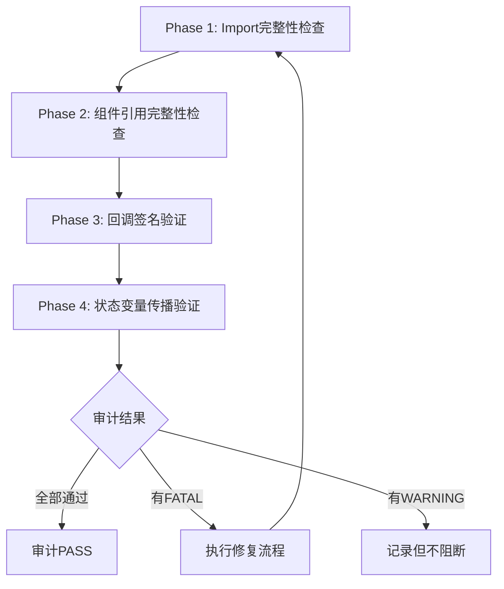

# 代码完整性审计规范

> **边界说明**：本文件负责结构完整性审计（Import/组件引用/回调签名/状态传播），与 methodology/behavior-audit.md 的语义等价审计互补。
>
> **说明**：本文档定义了代码完整性审计的标准流程、检查项和修复方法。本规范是 repo-understand-skill 的核心增强，确保在代码生成前验证代码仓完整性。

---

## 一、审计目的与背景

### 1.1 为什么需要代码完整性审计

在开源裁剪、分支合并、特性开关等场景下，代码仓可能处于不完整状态：

| 场景 | 表现 | 后果 |
|------|------|------|
| 开源裁剪 | 删除特性代码但保留import引用 | 编译失败 |
| 分支覆盖 | 覆盖时部分文件未同步 | 运行时崩溃 |
| 特性开关 | 条件编译跳过部分组件 | 功能缺失 |
| 模块重构 | 移动文件但未更新所有引用 | import断链 |

### 1.2 跳过审计的后果

```
错误路径：
  设计稿分析 → 立刻写代码 → import找不到 → 只能去git垃圾桶翻找

正确路径：
  设计稿分析 → 代码完整性审计 → 发现问题 → 从git恢复 → 再写代码
```

### 1.3 审计在Skill流程中的位置

```
repo-understand-skill 执行流程:
  Step 1: 识别输入类型
  Step 2: 功能维度识别
  Step 3: 代码仓索引查询
  Step 4: 分模式理解代码仓
  Step 5: 🆕 代码完整性审计（CRITICAL）
  Step 6: 差异分析
  Step 7: 输出配套MD文件
  
  ⚠️ Step 5 是 Step 6 的前置条件
  ⚠️ Step 5 不通过时，禁止进入 Step 6
```

---

## 二、审计执行流程

### 2.1 审计四阶段



### 2.2 Phase 1: Import完整性检查

#### 检查目标
验证所有 import 语句的目标文件存在且导出成员匹配。

#### 检查步骤

```yaml
import完整性检查步骤:
  1. 提取所有import语句
     - 使用 grep 搜索 "^import" 模式
     - 区分 lazy import 和普通 import
     
  2. 解析import路径
     - 解析模块别名（如 @myorg/common）
     - 映射到实际文件路径（参考 oh-package.json5）
     - 提取相对路径部分
     
  3. 验证文件存在性
     - 使用 glob 搜索文件路径
     - 注意大小写敏感（Windows vs Linux）
     
  4. 验证导出成员
     - 读取目标文件
     - 确认 export struct/class/function 存在
     - 特别检查 named export 和 default export
```

#### 常见问题类型

| 问题类型 | 示例 | 修复方法 |
|---------|------|---------|
| NOT_FOUND | 文件被删除 | 从git历史恢复 |
| WRONG_PATH | 包名拼写错误 | 修正路径 |
| MEMBER_MISSING | 导出名改变 | 确认当前导出名 |
| LAZY_BROKEN | lazy import目标不存在 | 检查模块是否正确导出 |

#### 示例

```typescript
// 检查前
import { EffectButton } from '@ohos/browsercommon/src/main/ets/default/view/EffectButton';

// 问题：@ohos 是旧包名，已废弃
// 验证：glob 搜索该路径 → 文件不存在

// 修复后
import { EffectButton } from '@myorg/browsercommon/src/main/ets/default/view/EffectButton';
```

### 2.3 Phase 2: 组件引用完整性检查

#### 检查目标
验证所有引用的子组件定义存在且属性匹配。

#### 检查步骤

```yaml
组件引用检查步骤:
  1. 提取build()中的组件引用
     - 识别 <ComponentName({ ... }) /> 模式
     - 识别 this.ComponentName({ ... }) 模式（Builder）
     
  2. 提取@Builder方法中的组件
     - 识别 @Builder 装饰的方法
     - 分析方法内的组件引用
     
  3. 验证组件文件存在
     - 使用 glob 搜索组件定义文件
     - 确认 @Component 装饰器存在
     
  4. 验证属性匹配
     - 读取组件的 @Prop/@Link 定义
     - 对比调用方传递的属性
```

#### 常见问题类型

| 问题类型 | 示例 | 修复方法 |
|---------|------|---------|
| COMPONENT_MISSING | 子组件文件不存在 | 从git恢复或创建 |
| PROP_MISMATCH | 传递了不存在的属性 | 添加属性或修正属性名 |
| LAZY_IMPORT_BROKEN | lazy import组件不存在 | 检查lazy关键字和导出 |

#### 示例

```typescript
// DetailPageView.ets
import { FeatureToggleView } from './FeatureToggleView';

// build() 中引用
FeatureToggleView({
  stateMachine: this.stateMachine,
  featureMode: this.featureMode,
  featureAction: this.featureAction,  // 🆕 新增属性
})

// 问题：FeatureToggleView 组件定义在 corelib
// 但未在 common 中被引用

// 验证：检查 FeatureToggleView 的 @Prop 定义是否包含 featureAction
// 问题：DetailPageView 传递了 featureAction，但 FeatureToggleView 没有接收该属性
// 修复：在 FeatureToggleView 中添加 @Prop featureAction: Action[] = []
```

### 2.4 Phase 3: 回调签名验证

#### 检查目标
验证 emitCallback/onCallback 参数数量和语义完全匹配。

#### 检查步骤

```yaml
回调签名检查步骤:
  1. 识别所有emitCallback调用
     - grep 搜索 "emitCallback("
     - 记录回调key名称
     - 记录传递的参数数组
     
  2. 识别所有onCallback注册
     - grep 搜索 "registerCallback("
     - 匹配相同的回调key
     - 记录接收函数的参数
     
  3. 对比参数数量
     - emit传递的参数数量
     - on接收的参数数量
     - 必须完全匹配
     
  4. 验证参数语义
     - 第1个参数代表什么
     - 参数顺序是否一致
     - 参数类型是否兼容
```

#### 常见问题类型

| 问题类型 | 示例 | 修复方法 |
|---------|------|---------|
| PARAM_COUNT_MISMATCH | emit传6个，on只接收5个 | 两端同步增加参数 |
| PARAM_TYPE_MISMATCH | emit传string，on期望number | 类型转换 |
| CALLBACK_MISSING | emit了但没有on注册 | 添加注册或删除emit |

#### 示例

```typescript
// BaseDetailPageController.ets (emit端)
this.emitCallback(AppConstants.MENU_KEY_UPDATE_CALLBACK,
  [menuList, toolMenuList, moreMenuList, showFeatureClose, isVideo, hdrParams, featureAction]);
// 7个参数

// DetailPageView.ets (on端)
updateMenu(menuList: Action[], toolMenuList: Action[], moreMenuList: Action[],
  showFeatureClose: boolean, showVideoCapsule?: boolean,
  hdrParams?: Map<string, number>): void {
  // 6个参数！缺少 featureAction

// 问题：hdrParams 被错误解析为 featureAction
// 修复：在 DetailPageView.updateMenu 中添加 featureAction?: Action[] 参数
```

### 2.5 Phase 4: 状态变量传播验证

#### 检查目标
验证 @State/@Prop/@Link/@Provide/@Consume 传播链完整且类型匹配。

#### 检查步骤

```yaml
状态变量传播检查步骤:
  1. 识别所有状态装饰器
     - @State, @Prop, @Link, @Provide, @Consume
     
  2. 构建传播链
     - @State → @Prop（单向）
     - @State → @Link（双向）
     - @Provide → @Consume（跨层级）
     
  3. 验证传递路径
     - 每个中间组件是否正确转发
     - 属性名是否匹配（或使用别名）
     - 类型是否一致
```

#### 常见问题类型

| 问题类型 | 示例 | 修复方法 |
|---------|------|---------|
| TYPE_MISMATCH | 传递number但接收方期望string | 类型转换 |
| CHAIN_BROKEN | 中间组件未转发状态 | 添加属性传递 |
| CYCLIC_DEPENDENCY | @Provide/@Consume循环 | 重构依赖关系 |

---

## 三、审计结果分级

### 3.1 FATAL级别（阻断）

| 类型 | 定义 | 处理方式 |
|------|------|---------|
| import目标不存在 | NOT_FOUND | 必须从git恢复或创建 |
| 组件文件缺失 | COMPONENT_MISSING | 必须从git恢复或创建 |
| 回调参数不匹配 | PARAM_COUNT_MISMATCH | 必须修复签名 |
| 循环依赖 | CYCLIC_DEPENDENCY | 必须重构代码 |

**处理规则**：FATAL问题未解决前，禁止进入差异分析步骤。

### 3.2 WARNING级别（警告）

| 类型 | 定义 | 处理方式 |
|------|------|---------|
| 导出成员缺失 | MEMBER_MISSING | 需要检查并修复 |
| 属性不匹配 | PROP_MISMATCH | 需要修正属性名 |
| 状态链断裂 | CHAIN_BROKEN | 需要添加转发 |

**处理规则**：WARNING问题需要记录但不阻断流程，但必须修复后才能完成skill。

### 3.3 INFO级别（信息）

| 类型 | 定义 | 处理方式 |
|------|------|---------|
| lazy import过多 | LAZY_IMPORT_OVERUSE | 建议优化 |
| 状态层级过深 | STATE_DEPTH_EXCEED | 建议重构 |

**处理规则**：INFO问题仅供参考，不影响流程。

---

## 四、审计修复流程

### 4.1 从git历史恢复缺失文件

```bash
# 1. 查找删除该文件的commit
git log --all --diff-filter=D --name-only -- "相对路径"

# 2. 从父commit恢复
git show <commit>^:<文件路径> > <文件路径>

# 3. 验证文件
wc -l <文件路径>  # 确认非空
```

### 4.2 批量修复import路径

```bash
# 替换包名前缀（不替换子路径）
# @oldorg/common → @myorg/common
# @oldorg/corelib → @myorg/corelib
# @oldorg/tools → @myorg/tools

# 示例：将恢复文件中的旧包名替换为新包名
sed -i 's/@oldorg\/common/@myorg\/common/g' <文件路径>
sed -i 's/@oldorg\/corelib/@myorg\/corelib/g' <文件路径>
```

### 4.3 修复回调签名

```typescript
// 规则：emit端新增参数时，所有接收方必须同步修改
// 原则：以数据源(emit端)为准

// emit端
emitCallback(KEY, [param1, param2, param3, param4, param5, param6, param7]);

// 接收方A
callback(param1, param2, param3, param4, param5, param6, param7) { }

// 接收方B（如果有多个）
callback(param1, param2, param3, param4, param5, param6, param7) { }
```

---

## 五、审计检查清单

### 审计前准备

```yaml
检查清单:
  ☐ 确认当前工作目录正确
  ☐ 确认git仓库状态正常
  ☐ 确认可以访问 oh-package.json5
```

### Phase 1 检查

```yaml
Import完整性:
  ☐ 提取所有import语句
  ☐ 解析每个import的模块别名
  ☐ 验证每个import目标文件存在
  ☐ 验证每个import的导出成员存在
```

### Phase 2 检查

```yaml
组件引用完整性:
  ☐ 提取build()中的组件引用
  ☐ 提取@Builder中的组件引用
  ☐ 验证每个引用的组件文件存在
  ☐ 验证传递给组件的属性与@Prop/@Link匹配
```

### Phase 3 检查

```yaml
回调签名:
  ☐ 识别所有emitCallback调用
  ☐ 识别所有registerCallback注册
  ☐ 匹配emit/on的回调key
  ☐ 对比参数数量完全匹配
```

### Phase 4 检查

```yaml
状态变量传播:
  ☐ 识别所有@State变量
  ☐ 追踪每个变量的传递路径
  ☐ 验证传递路径上类型一致
```

### 最终确认

```yaml
审计通过条件:
  ☐ 无FATAL级别问题
  ☐ 所有import可解析
  ☐ 所有组件引用完整
  ☐ 所有回调签名匹配
  ☐ 所有状态传播链完整
```

---

## 六、实战案例

### 案例：开源裁剪后功能组件缺失

#### 问题发现

```
Phase 1 发现:
  ❌ NOT_FOUND: EffectButton.ets
  ❌ NOT_FOUND: FeatureToggleComponent.ets
  ❌ NOT_FOUND: FeaturePopup.ets

Phase 3 发现:
  ❌ PARAM_COUNT_MISMATCH: MENU_KEY_UPDATE_CALLBACK
     emit端: 7个参数 [menuList, toolMenuList, moreMenuList, showFeatureClose, isVideo, hdrParams, featureAction]
     接收方: 6个参数 [menuList, toolMenuList, moreMenuList, showFeatureClose, showVideoCapsule, hdrParams]
```

#### 修复过程

```
Step 1: 从git恢复文件
  git log --diff-filter=D -- "**/EffectButton.ets"
  → 找到commit: 1d38dcb844b
  
  git show 1d38dcb844b^:NewApp/common/.../EffectButton.ets > 恢复文件

Step 2: 修复import路径
  @oldorg/common → @myorg/common
  @oldorg/corelib → @myorg/corelib
  @oldorg/tools → @myorg/tools

Step 3: 修复回调签名
  BaseDetailPageController.emitCallback → 添加featureAction参数
  DetailPageView.updateMenu → 添加featureAction?: Action[]参数

Step 4: 验证恢复完整性
  重新执行Phase 1-4审计
  → 全部通过
```

#### 关键教训

| 错误做法 | 正确做法 |
|---------|---------|
| 用 `toolMenuList.slice()` 替代 `featureAction` | 从 `FeatureHelper.getSupportedActions()` 获取真实数据 |
| 只修改部分接收方 | 两端同步修改（emit端和所有on端） |
| 不验证import路径 | 恢复后必须批量修复旧包名 → 新包名 |