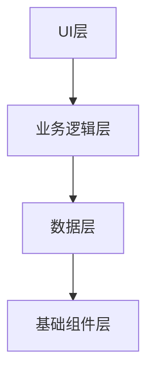
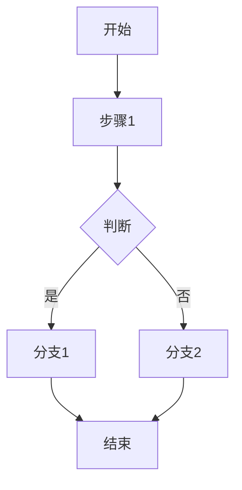
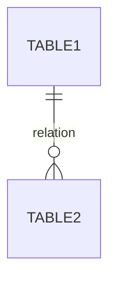

# 模块功能设计说明书

## 文档基本信息

### 文档标题与标识
格式：[领域]-[SDK/组件/应用]-[L0]-[L1]-[系统版本.小版本]

### 修订历史
| 日期 | 版本 | 作者 | 修改描述 | 审核人 |
|------|------|------|----------|--------|
| YYYY-MM-DD | v1.0 | 姓名 | 初始版本 | 姓名 |

### 术语表/名词解释
| 术语 | 解释 |
|------|------|
|      |      |

### 参考文档
- 需求文档：[链接或路径]
- UI设计稿：[链接或路径]
- 依赖库：[库名称及版本]
- API文档：[链接]
- 竞品文档：[链接]

## 系统与架构视图

### 架构设计图


### 关键业务框架及约束
- 分层设计说明
- 组件复用策略
- 异步/并发设计原则

### 外部依赖
- 平台框架依赖：[列表]
- 三方库依赖：[列表]
- 硬件依赖：[列表]
- 模型依赖：[列表]

### 设备适配策略（如涉及）
- 动态布局：[说明]
- 配置隔离：[说明]
- 多目标构建：[说明]

### 跨平台桥接设计（如涉及）
- 桥接层架构：[说明]
- 通信协议：[说明]
- 线程模型：[说明]
- 资源管理：[说明]

### 竞品分析（如涉及）
- 竞品实现方案：[分析]
- 优劣势对比：[对比]

## 模块详细设计

### UI组件设计（如涉及）
#### 组件职责
| 组件名称 | 职责 |
|----------|------|
|          |      |

#### 界面布局抽象
- 布局策略：[说明]
- 响应式设计：[说明]

#### 交互逻辑
- 用户交互：[说明]
- 事件处理：[说明]

#### 可复用UI组件
- 组件名称：[使用示例]

### 业务逻辑流程


#### 核心业务流程
- 正常流程：[说明]
- 异常分支：
  - 网络超时：[处理方式]
  - 权限拒绝：[处理方式]
  - 服务端错误：[处理方式]

### 异步及线程模型
- 耗时操作：[列表及处理策略]
- 线程模型：[说明]
- 主线程更新UI：[说明]

### 部署及运行模型
- 部署形态：[说明]
- 多进程：[如涉及，说明]
- 多线程：[如涉及，说明]
- 多实例：[如涉及，说明]
- 资源共享：[说明]

### 生命周期管理
- 应用生命周期：[说明]
- 组件生命周期：[说明]
- 组件复用：[说明]
- 配置变更处理：[说明]
- 内存告警处理：[说明]
- 防止内存泄漏：[说明]

### 其他
- 事件总线：[如涉及，说明]
- 特性隔离：[如涉及，说明]

## 接口设计

### 对外API设计（SDK/组件必选）
#### API列表
| API名称 | 功能描述 | 参数 | 返回值 | 异常 |
|---------|----------|------|--------|------|
|         |          |      |        |      |

#### API文档及示例
```typescript
// API示例
function example(param: Type): ReturnType {
  // 实现
}
```

### 回调/委托设计
| 回调名称 | 触发时机 | 取消机制 |
|----------|----------|----------|
|          |          |          |

### 跨进程通信IPC（如涉及）
- 接口文件：[说明]
- 数据序列化：[说明]
- 线程模型：[说明]
- 异常处理：[说明]

### 隐式意图/通用链接（如涉及）
- scheme/path规则：[说明]
- 参数解析：[说明]
- 安全验证：[说明]

## 数据设计

### 业务数据模型设计
```typescript
// 数据模型定义
interface ExampleModel {
  id: number;
  name: string;
}
```

| 模型名称 | 说明 | 字段 |
|----------|------|------|
|          |      |      |

### 本地存储方案（如涉及）
- 存储方式：[Preferences/文件/数据库]
- 数据备份：[说明]
- 数据克隆：[说明]
- 升级策略：[说明]

### 数据库设计（如涉及）
#### ER图


#### 表结构定义
| 表名 | 字段 | 类型 | 说明 | 索引 |
|------|------|------|------|------|
|      |      |      |      |      |

- 事务使用：[说明]
- 预填充数据库：[说明]

### 缓存设计（可选）
- 内存缓存：[说明]
- 磁盘缓存：[说明]
- 缓存大小限制：[说明]
- 缓存一致性：[说明]
- 键值命名规范：[说明]

### 敏感数据保护
| 数据类型 | 保护措施 |
|----------|----------|
| 密码     | 加密存储|
| 令牌     | 加密存储|
| 生物特征 | 加密存储|
| 个人隐私 | 加密存储|

## 非功能性设计

### 性能设计
#### 启动性能
- 冷启动时间：[目标]
- 优化措施：[懒加载、异步初始化]

#### UI流畅度
- 避免主线程耗时操作：[说明]
- 减少布局层级：[说明]
- 避免过度绘制：[说明]
- 数据缓存：[说明]
- 预加载：[说明]

#### 内存
- 预估内存占用：[说明]
- 避免内存泄漏：[说明]
- 按需动态加载：[说明]
- 内存警告处理：[说明]

#### 包体积
- 代码混淆：[说明]
- 动态库瘦身：[说明]
- 按需加载模块：[说明]
- 图片资源优化：[说明]

### 功耗设计（可选）
#### 前台UI
- 减少过度绘制：[说明]
- 避免不必要的刷新：[说明]
- 使用合适的动效：[说明]

#### 后台任务
- 定位优化：[说明]
- 网络轮询优化：[说明]
- 使用节能API：[说明]
- 避免频繁唤醒CPU：[说明]

### 网络设计（如涉及）
#### 网络请求
- 统一网络层：[说明]
- 超时设置：[说明]
- 重试机制：[说明]
- 缓存策略：[说明]

#### 弱网优化
- 请求合并：[说明]
- 数据压缩：[说明]
- 断点续传：[说明]
- 预加载：[说明]

#### 网络状态变化
- 监听连通性：[说明]
- 自动重试：[说明]
- 提示用户：[说明]

### 安全设计
- 代码混淆：[说明]
- 外部输入校验：[说明]
- 权限申请：[说明]
- 高风险API：[说明]

### 隐私合规
#### 数据收集声明
| 数据类型 | 用途 | 共享情况 |
|----------|------|----------|
| 设备信息 |      |          |
| 位置信息 |      |          |

#### 用户同意机制
- 弹出时机：[说明]
- 拒绝后降级处理：[说明]

#### 权限说明
| 权限 | 使用说明 |
|------|----------|
|      |          |

### 调试与定位
#### 日志
- 正式版本关闭DEBUG日志：[说明]
- 日志脱敏：[说明]
- 避免无效日志：[说明]

#### 调试开关
- 开关列表：[说明]
- 默认关闭：[说明]

#### 打点
- trace打点：[说明]
- 用户行为打点：[说明]
- 故障打点：[说明]

#### DT用例设计
- 功能覆盖：[说明]

### 国际化与本地化（可选）
- 字符串资源提取：[说明]
- RTL布局适配：[说明]

### 适老化与无障碍（可选）
- 适老化功能：[说明]
- 无障碍功能：[说明]

## SDK/组件特有设计

### 初始化设计（SDK必选）
- 初始化时机：[说明]
- Context传入：[说明]
- 多进程初始化：[说明]
- 初始化失败处理：[说明]

### 依赖管理
| 第三方库 | 版本 | 冲突风险 | 解决方案 |
|----------|------|----------|----------|
|          |      |          |          |

### SDK版本兼容
- 版本号规范：[语义化版本]
- API废弃策略：[说明]
- 向后兼容性：[说明]

### 集成文档
#### 接入步骤
1. [步骤1]
2. [步骤2]

#### 权限声明
| 权限 | 说明 |
|------|------|
|      |      |

#### 代码示例
```typescript
// 集成示例
```

#### 常见问题
| 问题 | 解决方案 |
|------|----------|
|      |          |

## 设计自检及CodeReview清单

### 文档基本信息
| 检查项 | 自检状态 | 备注 |
|--------|----------|------|
| 文档标题与标识符合规范 | ✅/❌/不涉及 |      |
| 修订历史完整 | ✅/❌/不涉及 |      |
| 术语表完整（如涉及） | ✅/❌/不涉及 |      |
| 参考文档完整 | ✅/❌/不涉及 |      |

### 架构设计
| 检查项 | 自检状态 | 备注 |
|--------|----------|------|
| 架构设计图清晰完整 | ✅/❌/不涉及 |      |
| 关键业务框架明确 | ✅/❌/不涉及 |      |
| 外部依赖清晰 | ✅/❌/不涉及 |      |
| 设备适配策略完整（如涉及） | ✅/❌/不涉及 |      |
| 跨平台桥接设计完整（如涉及） | ✅/❌/不涉及 |      |
| 竞品分析完整（如涉及） | ✅/❌/不涉及 |      |

### 模块设计
| 检查项 | 自检状态 | 备注 |
|--------|----------|------|
| UI组件设计完整（如涉及） | ✅/❌/不涉及 |      |
| 业务逻辑流程清晰 | ✅/❌/不涉及 |      |
| 异步及线程模型明确 | ✅/❌/不涉及 |      |
| 部署及运行模型清晰 | ✅/❌/不涉及 |      |
| 生命周期管理完整 | ✅/❌/不涉及 |      |

### 接口设计
| 检查项 | 自检状态 | 备注 |
|--------|----------|------|
| 对外API设计完整（SDK必选） | ✅/❌/不涉及 |      |
| 回调/委托设计完整 | ✅/❌/不涉及 |      |
| 跨进程通信设计完整（如涉及） | ✅/❌/不涉及 |      |
| 隐式意图设计完整（如涉及） | ✅/❌/不涉及 |      |

### 数据设计
| 检查项 | 自检状态 | 备注 |
|--------|----------|------|
| 业务数据模型设计完整 | ✅/❌/不涉及 |      |
| 本地存储方案完整（如涉及） | ✅/❌/不涉及 |      |
| 数据库设计完整（如涉及） | ✅/❌/不涉及 |      |
| 缓存设计合理（可选） | ✅/❌/不涉及 |      |
| 敏感数据保护措施完整 | ✅/❌/不涉及 |      |

### 性能设计
| 检查项 | 自检状态 | 备注 |
|--------|----------|------|
| 启动性能优化措施完整 | ✅/❌/不涉及 |      |
| UI流畅度优化措施完整 | ✅/❌/不涉及 |      |
| 内存优化措施完整 | ✅/❌/不涉及 |      |
| 包体积优化措施完整 | ✅/❌/不涉及 |      |

### 网络设计（如涉及）
| 检查项 | 自检状态 | 备注 |
|--------|----------|------|
| 网络请求设计完整 | ✅/❌/不涉及 |      |
| 弱网优化措施完整 | ✅/❌/不涉及 |      |
| 网络状态变化处理完整 | ✅/❌/不涉及 |      |

### 安全设计
| 检查项 | 自检状态 | 备注 |
|--------|----------|------|
| 代码混淆方案完整 | ✅/❌/不涉及 |      |
| 外部输入校验完整 | ✅/❌/不涉及 |      |
| 权限申请合理 | ✅/❌/不涉及 |      |
| 高风险API有权限控制 | ✅/❌/不涉及 |      |

### 隐私合规
| 检查项 | 自检状态 | 备注 |
|--------|----------|------|
| 数据收集声明完整 | ✅/❌/不涉及 |      |
| 用户同意机制完整 | ✅/❌/不涉及 |      |
| 权限说明完整 | ✅/❌/不涉及 |      |

### 调试与定位
| 检查项 | 自检状态 | 备注 |
|--------|----------|------|
| 日志策略完整 | ✅/❌/不涉及 |      |
| 调试开关合理 | ✅/❌/不涉及 |      |
| 打点方案完整 | ✅/❌/不涉及 |      |
| DT用例设计完整 | ✅/❌/不涉及 |      |

### SDK特有设计（如涉及）
| 检查项 | 自检状态 | 备注 |
|--------|----------|------|
| 初始化设计完整 | ✅/❌/不涉及 |      |
| 依赖管理清晰 | ✅/❌/不涉及 |      |
| SDK版本兼容策略完整 | ✅/❌/不涉及 |      |
| 集成文档完整 | ✅/❌/不涉及 |      |

### 其他
| 检查项 | 自检状态 | 备注 |
|--------|----------|------|
| 国际化与本地化完整（可选） | ✅/❌/不涉及 |      |
| 适老化与无障碍完整（可选） | ✅/❌/不涉及 |      |

## 功能间关联信息（增量设计）

### 依赖的已有功能
| 功能名称 | 设计文档路径 | 调用的类/方法 | 调用方式 | 数据传递 |
|----------|--------------|---------------|----------|----------|
|          |              |               |          |          |

### 可被后续功能复用的接口
| 类/方法名称 | 功能描述 | 调用方式 | 输入参数 | 返回值 | 使用示例 |
|-------------|----------|----------|----------|--------|----------|
|             |          |          |          |        |          |

### 功能间数据流向
| 数据流名称 | 起始功能 | 终止功能 | 数据结构 | 流向说明 |
|------------|----------|----------|----------|----------|
|            |          |          |          |          |

### 新增组件和接口说明
| 组件/接口名称 | 类型 | 功能描述 | 对外提供的接口 | 可被复用性 |
|---------------|------|----------|----------------|------------|
|               |      |          |                |            |

---

**⚠️ 重要提示**：
1. 本模板为标准设计文档结构，根据实际需求可适当调整
2. 必选（M）、条件必选（C）、可选（O）内容请参考 design-spec.md
3. 设计自检清单必须逐项填写自检状态（✅/❌/不涉及）和备注
4. 功能间关联信息是增量设计的关键，必须详细填写