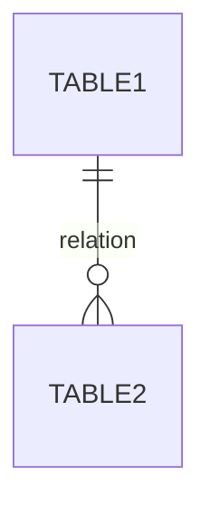

# 模块功能设计说明书——数据存储

## 目 录
1. 需求功能说明
2. 数据存储设计
   2.1 存储方案选型
       2.1.1 存储类型对比
       2.1.2 选型说明
   2.2 数据模型设计
       2.2.1 实体关系图
       2.2.2 表结构定义
       2.2.3 索引设计
   2.3 数据操作接口设计
       2.3.1 增删改查接口
       2.3.2 批量操作接口
       2.3.3 查询优化接口
   2.4 数据同步设计
       2.4.1 同步策略
       2.4.2 冲突处理
       2.4.3 离线缓存
3. 第零层设计描述
4. 第一层设计描述
   4.1 存储层架构设计
       4.1.1 分层架构
       4.1.2 模块职责
   4.2 数据流转设计
       4.2.1 写入流程
       4.2.2 读取流程
       4.2.3 同步流程
5. 第二层设计描述
   5.1 核心类设计
       5.1.1 数据库管理类
       5.1.2 数据访问对象（DAO）
       5.1.3 事务管理类
   5.2 关键流程实现
       5.2.1 数据库初始化
       5.2.2 事务处理流程
       5.2.3 数据迁移流程
6. 非功能设计
   6.1 性能设计
       6.1.1 查询性能优化
       6.1.2 存储空间优化
   6.2 可靠性设计
       6.2.1 数据备份
       6.2.2 异常恢复
       6.2.3 数据一致性保障
   6.3 安全性设计
       6.3.1 数据加密
       6.3.2 访问控制
       6.3.3 敏感数据处理
7. 附录
   7.1 数据库升级脚本
   7.2 常见问题
8. 修订记录

---

## 1 需求功能说明

[描述数据存储相关的功能需求、核心场景、特殊场景等]

---

## 2 数据存储设计

### 2.1 存储方案选型

#### 2.1.1 存储类型对比

| 存储类型 | 优点 | 缺点 | 适用场景 |
|---------|------|------|---------|
| Preferences | | | |
| SQLite | | | |
| 文件存储 | | | |
| Realm | | | |

#### 2.1.2 选型说明
[根据需求特点，选择XXX存储方案，说明原因]

### 2.2 数据模型设计

#### 2.2.1 实体关系图


#### 2.2.2 表结构定义

**表名（table）**

| 字段名 | 类型 | 长度 | 是否必填 | 默认值 | 说明 | 索引 |
|-------|------|------|---------|--------|------|------|
| | | | | | | |

#### 2.2.3 索引设计
| 索引名 | 表名 | 字段 | 索引类型 | 说明 |
|-------|------|------|---------|------|
| | | | | |

### 2.3 数据操作接口设计

#### 2.3.1 增删改查接口

[定义增删改查接口]

#### 2.3.2 批量操作接口

[定义批量操作接口]

#### 2.3.3 查询优化接口

[定义查询优化接口]

### 2.4 数据同步设计

#### 2.4.1 同步策略
[说明同步策略]

#### 2.4.2 冲突处理
| 冲突类型 | 处理策略 |
|---------|---------|
| | |

#### 2.4.3 离线缓存
[说明离线缓存机制]

---

## 3 第零层设计描述

[描述数据存储模块在整个系统中的位置和外部依赖]

[在此处放架构图]

[说明外部依赖]

---

## 4 第一层设计描述

### 4.1 存储层架构设计

#### 4.1.1 分层架构
[说明分层架构]

#### 4.1.2 模块职责
| 模块 | 职责 |
|------|------|
| | |

### 4.2 数据流转设计

#### 4.2.1 写入流程
```mermaid
sequenceDiagram
    ...
```

#### 4.2.2 读取流程
```mermaid
sequenceDiagram
    ...
```

#### 4.2.3 同步流程
```mermaid
sequenceDiagram
    ...
```

---

## 5 第二层设计描述

### 5.1 核心类设计

#### 5.1.1 数据库管理类
[定义数据库管理类]

#### 5.1.2 数据访问对象（DAO）
[定义DAO类]

#### 5.1.3 事务管理类
[定义事务管理类]

### 5.2 关键流程实现

#### 5.2.1 数据库初始化
[说明数据库初始化流程]

#### 5.2.2 事务处理流程
[说明事务处理流程]

#### 5.2.3 数据迁移流程
[说明数据迁移流程]

---

## 6 非功能设计

### 6.1 性能设计

#### 6.1.1 查询性能优化
[说明查询性能优化措施]

#### 6.1.2 存储空间优化
[说明存储空间优化措施]

### 6.2 可靠性设计

#### 6.2.1 数据备份
[说明数据备份方案]

#### 6.2.2 异常恢复
[说明异常恢复方案]

#### 6.2.3 数据一致性保障
[说明数据一致性保障措施]

### 6.3 安全性设计

#### 6.3.1 数据加密
[说明数据加密方案]

#### 6.3.2 访问控制
[说明访问控制方案]

#### 6.3.3 敏感数据处理
[说明敏感数据处理方案]

---

## 7 附录

### 7.1 数据库升级脚本
[提供数据库升级脚本]

### 7.2 常见问题
| 问题 | 原因 | 解决方案 |
|------|------|---------|
| | | |

---

## 8 修订记录

| 日期 | 修订版本 | 修改章节 | 修改描述 | 作者 |
|------|---------|---------|---------|------|
| YYYY-MM-DD | v1.0 | | | |

---

**⚠️ 重要提示：**
1. 本模板为数据存储类型设计文档结构
2. 数据模型设计需要根据实际业务需求调整
3. 索引设计需要根据查询场景优化
4. 数据同步策略需要根据网络环境调整