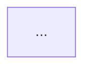

# 模块功能设计说明书——网络通信

## 目 录
1. 需求功能说明
2. 网络架构设计
   2.1 网络拓扑
   2.2 通信协议选型
       2.2.1 协议对比
       2.2.2 选型说明
   2.3 接口设计
       2.3.1 RESTful API
       2.3.2 WebSocket接口
       2.3.3 消息推送接口
3. 第零层设计描述
4. 第一层设计描述
   4.1 网络层架构
       4.1.1 分层设计
       4.1.2 模块职责
   4.2 通信流程设计
       4.2.1 请求流程
       4.2.2 响应处理流程
       4.2.3 错误处理流程
5. 第二层设计描述
   5.1 核心类设计
       5.1.1 网络请求类
       5.1.2 拦截器
       5.1.3 缓存管理类
   5.2 关键流程实现
       5.2.1 请求发起流程
       5.2.2 重试机制
       5.2.3 断点续传流程
6. 非功能设计
   6.1 性能设计
       6.1.1 请求优化
       6.1.2 弱网优化
       6.1.3 连接池管理
   6.2 可靠性设计
       6.2.1 超时处理
       6.2.2 失败重试
       6.2.3 熔断降级
   6.3 安全性设计
       6.3.1 HTTPS加密
       6.3.2 认证授权
       6.3.3 数据签名
       6.3.4 防重放攻击
7. 附录
   7.1 接口文档
   7.2 错误码定义
8. 修订记录

---

## 1 需求功能说明

[描述网络通信相关的功能需求、核心场景、特殊场景等]

---

## 2 网络架构设计

### 2.1 网络拓扑


### 2.2 通信协议选型

#### 2.2.1 协议对比

| 协议 | 优点 | 缺点 | 适用场景 |
|------|------|------|---------|
| HTTP/1.1 | | | |
| HTTP/2 | | | |
| WebSocket | | | |
| MQTT | | | |

#### 2.2.2 选型说明
[根据需求特点，选择XXX协议，说明原因]

### 2.3 接口设计

#### 2.3.1 RESTful API
[定义RESTful API接口]

#### 2.3.2 WebSocket接口
[定义WebSocket接口]

#### 2.3.3 消息推送接口
[定义消息推送接口]

---

## 3 第零层设计描述

[描述网络模块在整个系统中的位置和外部依赖]

[在此处放架构图]

[说明外部依赖]

---

## 4 第一层设计描述

### 4.1 网络层架构

#### 4.1.1 分层设计
[说明分层架构]

#### 4.1.2 模块职责
| 模块 | 职责 |
|------|------|
| | |

### 4.2 通信流程设计

#### 4.2.1 请求流程
```mermaid
sequenceDiagram
    ...
```

#### 4.2.2 响应处理流程
[说明响应处理流程]

#### 4.2.3 错误处理流程
| 错误类型 | 处理方式 |
|---------|---------|
| | |

---

## 5 第二层设计描述

### 5.1 核心类设计

#### 5.1.1 网络请求类
[定义网络请求类]

#### 5.1.2 拦截器
[定义拦截器]

#### 5.1.3 缓存管理类
[定义缓存管理类]

### 5.2 关键流程实现

#### 5.2.1 请求发起流程
[说明请求发起流程]

#### 5.2.2 重试机制
[说明重试机制]

#### 5.2.3 断点续传流程
[说明断点续传流程]

---

## 6 非功能设计

### 6.1 性能设计

#### 6.1.1 请求优化
[说明请求优化措施]

#### 6.1.2 弱网优化
[说明弱网优化措施]

#### 6.1.3 连接池管理
[说明连接池管理方案]

### 6.2 可靠性设计

#### 6.2.1 超时处理
[说明超时处理方案]

#### 6.2.2 失败重试
[说明失败重试方案]

#### 6.2.3 熔断降级
[说明熔断降级方案]

### 6.3 安全性设计

#### 6.3.1 HTTPS加密
[说明HTTPS加密方案]

#### 6.3.2 认证授权
[说明认证授权方案]

#### 6.3.3 数据签名
[说明数据签名方案]

#### 6.3.4 防重放攻击
[说明防重放攻击方案]

---

## 7 附录

### 7.1 接口文档
[详细的API接口文档]

### 7.2 错误码定义
| 错误码 | 说明 | 处理建议 |
|-------|------|---------|
| | | |

---

## 8 修订记录

| 日期 | 修订版本 | 修改章节 | 修改描述 | 作者 |
|------|---------|---------|---------|------|
| YYYY-MM-DD | v1.0 | | | |

---

**⚠️ 重要提示：**
1. 本模板为网络通信类型设计文档结构
2. 接口设计需要遵循RESTful规范
3. 安全设计需要重点关注数据加密和防重放攻击
4. 弱网优化需要根据实际网络环境调整参数