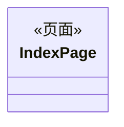
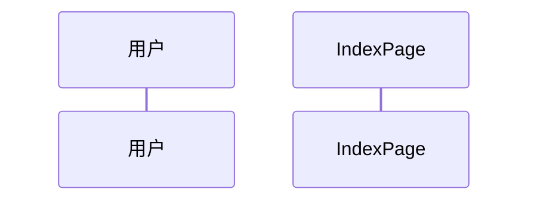

# 页面设计方案 — {页面名称}

## 1. 设计概述

### 1.1 页面定位

| 属性 | 值 |
|------|------|
| 页面名称 | {页面名称} |
| 所属模块 | {模块名称} |
| 设计模式 | 新建页面 / 存量增强 |

### 1.2 UX 设计稿与需求功能的归属映射

| UX 区域/场景 | 对应需求功能点 | 是否在本次实现范围 | 设计策略 |
|-------------|--------------|-------------------|---------|
| | | ✅ 是 / ❌ 否 | 按 UX 设计实现 / 保持不变 / 后续迭代 |

### 1.3 功能边界说明

- **本次实现范围**：[描述本次要实现的功能点]
- **不在本次范围**：[描述 UX 设计稿中可见但不属于本次实现的功能]
- **未在 UX 设计稿中体现的功能**：[描述需求中有但 UX 设计稿未展示的功能点及设计策略]

---

## 2. 页面组件架构

### 2.1 组件树结构图

```
页面根容器
├── [新增] 区域A (Column)
│   ├── [新增] 组件A1 (Text)
│   ├── [修改] 组件A2 (Button) — 修改点：样式适配
│   └── [新增] 组件A3 (Image)
├── [无关] 区域B (Row) — 属于导航模块，本次不实现
│   ├── [复用] 组件B1 (Text)
│   └── [复用] 组件B2 (Icon)
└── [新增] 区域C (List)
    └── [新增] 列表项 (ListItem)
```

> 节点标注格式：`[分类] 组件名 (组件类型)`，分类：新增 / 修改 / 复用 / 无关

### 2.2 元素分类汇总

| 节点 ID | 组件类型 | 分类 | 说明 |
|---------|---------|------|------|
| | | 新增/修改/复用/无关 | |

### 2.3 HDS 组件替换映射（如 use_hds = true）

#### 2.3.0 HDS 决策

- `hdsRequired`: true / false
- 决策结论：
- HDS 候选区域：
- HDS 候选组件：
- API 可用性状态：已验证 / 待第四阶段 import+构建验证 / 已失败且用户批准降级
- 禁止使用的 false 理由检查：
  - `oh-package.json5` 未声明 `@kit.UIDesignKit`：不得作为 false 理由
  - 标准 ArkUI 的 `backdropBlur()` / `linearGradient()` / `backgroundImage()` / `opacity()` 足以近似：不得作为 false 理由
  - 避免兼容性问题 / 保守起见 / 后续可增量引入：不得作为 false 理由
- 如果 `hdsRequired: false`，必须填写允许原因：
  - 用户明确要求不用 HDS；或
  - 设计稿和需求无 HDS 候选区域且项目无 HDS 痕迹；或
  - 已有 import/构建/类型检查错误且用户批准降级

> 填写要求：当需求或设计稿出现"沉浸光感"、"沉浸式"、"动态模糊"、"悬浮材质"、"HDS 6.1"、"光感"，或页面包含顶部导航、底部 Tabs、底部操作栏、悬浮工具栏、滚动联动区域时，默认应输出 `hdsRequired: true` 和 HDS 候选组件映射。API 可用性未知时写"待第四阶段验证"，不得写 `hdsRequired: false`。

| 原始组件 | HDS 组件 | 节点 ID | 替换说明 |
|---------|---------|---------|---------|
| | | | |

### 2.4 沉浸光感还原设计（如 immersive_light_spec = true/auto）

| 节点 ID | UX 区域 | 原始实现 | 目标组件/方案 | 是否启用沉浸光感 | 光感/模糊策略 | 滚动容器绑定 | API 可用性 | 降级策略 | 验收标准 |
|---------|---------|----------|---------------|------------------|---------------|--------------|------------|----------|----------|
| | 顶部导航栏 / 底部页签 / 底部操作栏 / 内容区 | Row/Column/Tabs/Navigation/... | HdsNavigation/HdsNavDestination/HdsTabs/HdsActionBar/自定义悬浮容器 | 是/否 | 动态模糊 / 渐变模糊 / 悬浮页签 / 跟手分割线 / 透明背景过渡 / 不启用 | scroller / tabsController / 无 | public_only / internal_allowed / unknown | 保留原组件 / 使用公开双样式 / 关闭材质块 / 补充安全区 | 滚动前/中/后视觉状态清晰，不遮挡内容和交互区域 |

> 填写要求：当需求或设计稿出现"沉浸光感"、"沉浸式"、"动态模糊"、"悬浮"、"毛玻璃"、"HDS 6.1"等描述时，本表必填。不要只写"使用沉浸光感"，必须明确到节点、目标组件、滚动绑定、API 可用性、降级策略和验收标准。
> 标准 ArkUI 的 `backdropBlur()`、`linearGradient()`、`backgroundImage()`、`opacity()` 只能作为 HDS 配套视觉补充或经验证失败并获用户批准后的降级策略，不能作为 `hdsRequired: false` 的理由。

### 2.5 布局参数汇总

| 节点 | 容器类型 | 布局方向 | 对齐 | 间距 | 响应式宽度 | 响应式高度 | bbox |
|------|---------|---------|------|------|-----------|-----------|------|
| | Column/Row/Grid/Stack | 垂直/水平 | | gap: | percentage/flex/auto/fixed | percentage/flex/auto/fixed | [x1,y1,x2,y2] |

### 2.6 自定义组件清单

| 组件名 | 职责 | Props 接口 | 来源 |
|--------|------|-----------|------|
| | | | 新增 / 复用 / 适配 |

---

## 3. 状态管理设计

### 3.1 状态变量声明表

| 组件 | 状态变量 | 装饰器 | 类型 | 初始值 | 说明 |
|------|---------|--------|------|--------|------|
| | | @State/@Prop/@Link | | | |

### 3.2 断点状态设计（如涉及响应式）

| 状态变量 | 类型 | 断点值 |
|---------|------|--------|
| | BreakpointState\<T\> / WidthBreakpointType\<T\> | sm: / md: / lg: |

### 3.3 状态流向图

```
IndexPage
  ├── @State items ──@Prop──> ListItem
  ├── @State isLoading ──> Button.disabled
  └── @Link selectedTab <──> Tabs
```

### 3.4 与存量模式的一致性说明（模式B）

| 存量模式 | 本次设计 | 一致性 |
|---------|---------|--------|
| @State + @Prop | @State + @Prop | ✅ 一致 |
| | | |

---

## 4. 事件处理与交互设计

### 4.1 事件绑定表

| 组件 | 事件类型 | 处理函数 | 说明 |
|------|---------|---------|------|
| | onClick / onChange / onSubmit / onScroll / ... | | |

### 4.2 导航跳转设计

| 触发条件 | 目标页面 | 路由方式 | 传参 |
|---------|---------|---------|------|
| | | router.pushUri / router.replaceUri / Navigation | |

### 4.3 组件联动逻辑

| 联动关系 | 触发条件 | 联动效果 |
|---------|---------|---------|
| | | |

### 4.4 新增逻辑与存量逻辑关系设计（模式B）

| 新增逻辑 | 关联存量逻辑 | 关系类型 | 触发机制 | 调用边界 |
|---------|-------------|---------|---------|---------|
| | | 独立/顺序/条件/扩展/共享 | | |

---

## 5. 数据模型设计

### 5.1 interface 定义

```typescript
interface PageData {
  // 字段定义
}
```

### 5.2 数据源标注

| 数据模型 | 数据源类型 | 说明 |
|---------|-----------|------|
| | 静态硬编码 / 网络请求 / 本地存储 / 计算派生 | |

### 5.3 与存量数据模型的关系（模式B）

| 本次数据模型 | 对应存量模型 | 关系 | 说明 |
|-------------|-------------|------|------|
| | | 新增 / 复用 / 扩展 | |

---

## 6. 类图



> 蓝色 = 新增类，灰色 = 存量类

### 类关系说明

| 类关系 | 类型 | 方向 | 说明 |
|--------|------|------|------|
| | 聚合/组合/依赖 | 新增→新增 / 新增→存量 | |

---

## 7. 时序图

### 场景1：{场景名称}



### 场景2：{异常场景}


---

## 8. 文件修改清单（模式B）

### 新增文件

| 文件路径 | 功能说明 |
|---------|---------|
| | |

### 修改文件

| 文件路径 | 修改内容 |
|---------|---------|
| | |

---

## 9. [模式B] 新增逻辑与存量逻辑交互设计汇总

| 新增逻辑 | 存量逻辑 | 交互方式 | 数据流向 | 异常处理 |
|---------|---------|---------|---------|---------|
| | | | | |

---

## 10. [模式B] 代码仓参考实现汇总

| 参考实现 | 来源文件 | 复用方式 | 说明 |
|---------|---------|---------|------|
| | | 直接复用 / 适配修改 | |

---

## 设计自检清单

### 归属映射完整性

| 检查项 | 自检状态 | 备注 |
|--------|----------|------|
| UX 设计稿的所有区域均已建立归属映射 | ✅/❌ | |
| 不在本次范围的 UX 元素已标注为"无关" | ✅/❌ | |
| 未在 UX 设计稿中体现的功能已补充设计策略 | ✅/❌ | |

### 元素分类完整性

| 检查项 | 自检状态 | 备注 |
|--------|----------|------|
| 组件树所有节点均已分类（新增/修改/复用/无关） | ✅/❌ | |
| "修改"类元素已说明修改点 | ✅/❌ | |
| HDS 组件替换映射完整（如 use_hds） | ✅/❌ | |

### 沉浸光感完整性

| 检查项 | 自检状态 | 备注 |
|--------|----------|------|
| 沉浸光感相关节点均已逐节点标注 | ✅/❌ | |
| 顶部/底部悬浮区域已声明是否覆盖内容区 | ✅/❌ | |
| Scroll/List/Grid 与 HDS 导航或页签的绑定关系已说明 | ✅/❌ | |
| HDS/API 可用性与降级策略已说明 | ✅/❌ | |
| 未把沉浸光感泛化到所有卡片、列表项、普通容器 | ✅/❌ | |

### 设计一致性

| 检查项 | 自检状态 | 备注 |
|--------|----------|------|
| 状态管理与存量代码模式一致（模式B） | ✅/❌ | |
| 事件处理覆盖所有交互组件 | ✅/❌ | |
| 数据模型字段与 UX 设计稿内容对应 | ✅/❌ | |
| 布局参数与 UX 设计稿响应式策略一致 | ✅/❌ | |
| 类图覆盖所有组件和数据模型 | ✅/❌ | |
| 时序图覆盖关键交互场景（含异常） | ✅/❌ | |
